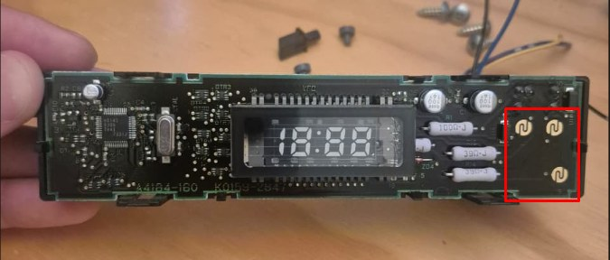

# Subaru-ESP32-SLOW

### **S**SM2 **L**ink **O**ver **W**ireless

**Retromod instrumentation and speed-based central locking for a Subaru Legacy 3.0R (BL/BP chassis, EDM), built from two ESP32 nodes linked by ESP-NOW.**

The car's OEM clock display is replaced by a monochrome OLED that polls the ECU
over **SSM2** on the K-line; a second, physically separate node next to the BIU
locks the doors above 20 km/h and unlocks them at a standstill. The two nodes
share no wiring — only a radio link.

This repository is the engineering record: schematic-level design with exact
component values, pin maps, board layouts, firmware behaviour specification,
installation procedure, and the reasoning behind each decision. Prototype
revision **v0.1**; the hardware is specified and being sourced, the firmware is
specified but not yet written.

Start at [`docs/00-concept/README.md`](docs/00-concept/README.md).

*The name is a backronym, and an accurate one: an SSM2 link is exactly what
travels over the air between the two nodes. That it also describes a 3.0R is
a coincidence nobody is obliged to accept.*


---

## The constraint that drives everything: this is a retromod

**No colour screens. No IPS or TFT panels. Nothing that looks like an aftermarket
part.** The car must read as stock to anyone who did not install this.

That is not decoration — it is the top-level requirement, and it decides most of
the hardware:

| Retromod requirement | What it forces in the design |
| --- | --- |
| No colour / IPS / TFT display | Monochrome **OLED SSD1322**, 256×64, amber, behind the original red filter |
| Keep the OEM clock position | Board must fit the clock housing — hence the 11 × 27 hole carrier and the 90° header row |
| Reuse the OEM frame and bezel | The OLED is retained by a 3D-printed bezel inside the original housing, not by its own pins |
| Reuse OEM buttons | 4 existing buttons drive the gauge UI; the auto-lock ON/OFF is an **unused OEM switch**, not a new one |
| Reuse the original trip-computer position | Same bay, same viewing angle, same night-time illumination behaviour (ILL input follows the dash rheostat) |
| Fully reversible | Everything hangs off an i59 pass-through adapter and latching connectors; unplug it and the car is stock |

The auto-lock ON/OFF control is a good example: rather than drilling a new
button, it reuses the **windscreen-wiper de-icer switch** — a North-American
market option this EDM car does not have, so the switch position exists in the
console but does nothing. See [ADR 0003](docs/decisions/0003-onoff-button-direct-to-node-a.md).


And the gauge controls are the OEM buttons themselves. A donor unit was taken
apart to find out how they are built: they turn out to be contact pads on the
OEM board, closed by a conductive rubber pad — an ordinary dry contact an ESP32
input can read directly, with no new buttons to design or fit. See
[ADR 0004](docs/decisions/0004-reuse-oem-contact-pad-buttons.md).



## Why ESP32, and why two nodes

The ESP32 was chosen primarily for **ESP-NOW** — a connectionless peer-to-peer
protocol on the 2.4 GHz PHY that needs no router, no pairing infrastructure and
no association. That single capability is what makes the architecture modular:

- **The gauge and the locking function are electrically unrelated** and live in
  different parts of the car (centre console vs. A-pillar / BIU). Splitting them
  avoids running a long harness between the two and decouples their failures.
- **Speed is measured once and shared.** Node B already reads the ECU over SSM2,
  so vehicle speed comes from there and travels to Node A by radio — no VSS tap,
  no signal conditioning (see [ADR 0002](docs/decisions/0002-speed-over-ssm2-not-vss.md)).
- **Growth is by adding nodes, not by adding wires.** Any future I/O — extra
  sensors, another actuator, a second display — becomes another wireless node
  that joins the same link. Nothing in the existing harness has to change.

The ESP32 also brings enough on-chip peripherals for both roles (UART for the
K-line, SPI for the OLED, I²C for the RTC, ADC for the divided analogue inputs)
on a single 3.3 V part.

## Scope

**Locked for the first build** — nothing else is being designed until this works
in the car:

1. SSM2 acquisition over the K-line
2. Monochrome OLED gauge in the OEM clock position
3. Integration with the existing OEM buttons
4. Speed-based automatic central locking

A list of additional features is **being drawn up** and is deliberately not part
of this revision. See [`ROADMAP.md`](ROADMAP.md).

## Repository layout

```
.
├── docs/
│   ├── 00-concept/        Purpose, architecture, design rationale, status
│   │   └── source/        Original v0.1 design document (HTML, Spanish), kept verbatim
│   ├── 01-hardware/       Component catalogue, BOM, both nodes, wiring, figures, photos
│   ├── 02-firmware/       Behavioural specification for both nodes
│   ├── 03-software/       Host-side / tooling notes (empty at v0.1)
│   ├── 04-integration/    Install sequence, multimeter checklist, open vehicle checks
│   ├── decisions/         Architecture decision records (why, not just what)
│   └── references.md      Datasheets, standards, prior art and forum sources
├── firmware/              Node A and Node B firmware — not yet written
├── hardware/              KiCad / EasyEDA project — v0.2 (PCB)
├── software/              Supporting host software
├── scripts/               Figure generator (source of truth for every diagram)
├── ROADMAP.md             Locked scope, and the additional-feature list in progress
├── CONTRIBUTING.md        Branch and review workflow
└── SETUP-GITHUB.md        How to create the repo and finish the licence, from scratch
```

## Figures

Every figure in `docs/01-hardware/diagrams/` is generated by
[`scripts/generate_diagrams.py`](scripts/generate_diagrams.py) — that script is
the editable source, and only the rendered PNGs are committed. They are drawn
dark-mode native. To rebuild them:

```bash
python3 scripts/generate_diagrams.py
```

The renderer refuses to pass silently: it checks every element against the
viewBox and every label against every other label, and reports overflow or
collisions instead of emitting a broken image.

## Prior art and credits

This project stands on published work by other people. It is a different design
— two ESP32 nodes and ESP-NOW rather than a single Arduino — but the SSM2
groundwork and the "put a gauge in the clock pod" idea are not original here.

**Repositories**

- **[Obeisance/SubaruSSMClockPodMod](https://github.com/Obeisance/SubaruSSMClockPodMod)** —
  Arduino code for OBD communication with a GD-chassis Subaru WRX, including
  routines for the Subaru Select Monitor protocol, driving a clock-pod display.
  The closest published analogue to what this project does, and the direct
  inspiration for the clock-pod approach.
- **[matprophet/subduino](https://github.com/matprophet/subduino)** — Arduino
  project for Subaru SSM to CAN-bus conversion; polls a WRX/STi ECU over SSM2 on
  the K-line by addressing specific parameters rather than block reads, using an
  MC33660 K-line interface. Useful reference for the polling strategy.
- **[starlingcrossgte-svg/PROTOCOL](https://github.com/starlingcrossgte-svg/PROTOCOL)** —
  GPLv3 **Android** tool (Java) for Subaru SSM2 diagnostics over K-line and CAN,
  plus bench ECU/TCM firmware work on SH7058, supporting Tactrix OpenPort,
  OBDLink, STN and FT232 KKL adapters. Not an Arduino project — a useful
  cross-check on SSM2 addressing and adapter behaviour. Its author marks it
  unfinished and experimental.
- **[hrdwrbob/eingauge](https://github.com/hrdwrbob/eingauge)** — a gauge system
  written in Python with an Arduino sensor back end. Not Subaru-specific;
  referenced for gauge presentation and data-acquisition structure. Marked as
  work in progress by its author.
- **[rpkish/Subduino-SSM](https://github.com/rpkish/Subduino-SSM)** — cited as an
  SSM2-on-microcontroller precedent in the original v0.1 design document.

**Forum work**

- *"Clock pod mod with Subarb Select Monitor ECU polling and Arduino"* by
  **Obeisance**, ClubWRX —
  [thread](https://www.clubwrx.net/threads/clock-pod-mod-with-subarb-select-monitor-ecu-polling-and-arduino.134423369/).
  Ten-plus pages of build log behind the repository above. (The spelling
  "Subarb" is the thread's own.)
- *"Detailed SSM to Can-bus Convertor DIY"* by **Ajzride**, The Factory Five
  Forum — [thread](https://thefactoryfiveforum.com/thread/119120).

…among others. Everything consulted is listed in
[`docs/references.md`](docs/references.md), which also flags which sources have
been verified and which have not.

## Use of AI

**Parts of this repository were produced with AI assistance (Claude, by
Anthropic).** Being specific about what that means:

- **Documentation:** the English documentation in `docs/` was drafted, structured
  and translated with Claude, from a Spanish-language design document written by
  the project author. The engineering content — architecture, component
  selection, values, pin assignments, installation procedure — is the author's.
- **Figures:** the diagram generator in `scripts/` was written with Claude, and
  the figures it produces were redrawn from hand-made SVGs in that original
  document.
- **Firmware and software:** AI assistance is expected to be used for the
  implementation in `firmware/` and `software/` as well, once it is written.

Neither the design decisions nor the measurements are AI-generated. Where a fact
could not be verified, the documentation says so explicitly rather than
guessing — see the open items in
[`docs/04-integration/README.md`](docs/04-integration/README.md#open-checks-on-the-vehicle).

## Licence

Dual-licensed, strong copyleft on both sides:

- **Hardware** (schematics, layouts, mechanical): **CERN-OHL-S v2** —
  [`LICENSE-HARDWARE.txt`](LICENSE-HARDWARE.txt), full text included.
- **Firmware and software**: **GPL-3.0-or-later** —
  [`LICENSE-SOFTWARE.txt`](LICENSE-SOFTWARE.txt). SPDX identifier is set; the
  full text still has to be inserted from an authoritative source, see
  [`SETUP-GITHUB.md`](SETUP-GITHUB.md) section 5.

## Status and next steps

- [ ] Complete `LICENSE-SOFTWARE.txt` with the official GPL-3.0 text
- [ ] Resolve the six [open checks on the vehicle](docs/04-integration/README.md#open-checks-on-the-vehicle) — they are measurements, not assumptions
- [ ] Write the firmware for both nodes from [`docs/02-firmware/`](docs/02-firmware/README.md)
- [ ] Fill in the additional-feature list in [`ROADMAP.md`](ROADMAP.md)
