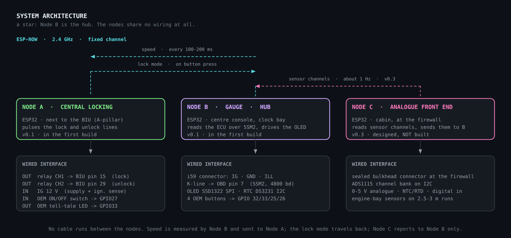

# 00 — Concept

> Derived from the v0.1 design document
> ([`source/Documento_matriz_v0.1_Legacy_3.0R.html`](source/Documento_matriz_v0.1_Legacy_3.0R.html),
> Spanish, kept verbatim). This page carries its purpose, architecture and design
> rationale into English. Figures were **redrawn** — see
> [`source/README.md`](source/README.md) for what was and was not carried over.

Vehicle: **Subaru Legacy 3.0R, BL/BP chassis, EDM (European/Export Domestic Market)**.

## Purpose and scope

Two functions are added to the car without irreversibly altering its factory
electronics:

1. A **multi-function gauge** that replaces the OEM clock display, reading the
   ECU over SSM2.
2. **Speed-based central locking**, with automatic unlock at a standstill.

Both are implemented as independent ESP32 nodes communicating over ESP-NOW. The
governing constraint is that the result must read as a **retromod** — no colour
or IPS/TFT screens, OEM buttons, OEM frame, OEM clock position, OEM trip-computer
bay. See the [README](../../README.md#the-constraint-that-drives-everything-this-is-a-retromod)
for how that constraint propagates into the hardware.

## Prototype status (v0.1)

| Area | State |
| --- | --- |
| High-level design | Closed — architecture, functional split, interfaces |
| Detailed design | Closed at component level: per-stage values, physical layout on perfboard, wiring for both nodes |
| Materials | Specified (see [BOM](../01-hardware/README.md#bom-with-indicative-prices)); being sourced |
| Firmware | Behaviour specified (see [`docs/02-firmware/`](../02-firmware/README.md)); **not implemented** |
| Vehicle validation | **Seven open checks** — measurements to make, not assumptions. See [`docs/04-integration/`](../04-integration/README.md#open-checks-on-the-vehicle) |

## Architecture

**Fig. 1** — Two nodes, no wire between them. Speed is measured by Node B and
sent to Node A; the lock mode travels back the other way.

| | Node A — central locking | Node B — gauge |
| --- | --- | --- |
| Location | Next to the BIU, A-pillar | Centre console, clock bay |
| Reads | IG 12 V (ignition sense), SW1 ON/OFF switch | SSM2 over K-line, ILL, 4 OEM buttons, optional analogue input |
| Drives | 2 relay channels → BIU pins 15 / 29 | OLED SSD1322 over SPI |
| Sends over ESP-NOW | Lock mode, on button press | Vehicle speed, every 100–200 ms |
| Detail | [`node-a-locking.md`](../01-hardware/node-a-locking.md) | [`node-b-gauge.md`](../01-hardware/node-b-gauge.md) |

## Structural decisions

- **No VSS tap.** Node A does not tap the speed signal and uses no comparator. It
  receives speed from Node B over ESP-NOW; Node B gets it from the ECU over SSM2.
  Rationale below and in [ADR 0002](../decisions/0002-speed-over-ssm2-not-vss.md).
- **Fully serviceable.** No expensive module is permanently soldered; everything
  is socketed or on a latching connector.
- **Zero parasitic draw.** Everything is fed from IG. With the key out, both
  nodes are dead. The clock is held by the RTC's own cell.
- **ON/OFF control is an unused OEM switch, wired straight to Node A.** The
  windscreen-wiper de-icer button — a North-American-market feature this car does
  not have — becomes the auto-lock toggle on GPIO27. This makes ESP-NOW
  bidirectional: Node A tells Node B to confirm the mode on the OLED.
  See [ADR 0003](../decisions/0003-onoff-button-direct-to-node-a.md).

## Design rationale

Each choice below has a functional argument (what problem it solves) and a
technical one (why this solution and not another). Bracketed numbers refer to
[`docs/references.md`](../references.md).

### Two independent nodes linked by radio

**Functional:** the gauge and the locking function have no electrical
relationship and live in different physical zones of the car (centre console vs.
A-pillar / BIU).

**Technical:** separating them avoids running a long harness between the two and
decouples failures — if one node reboots, the other keeps working. The link uses
**ESP-NOW**, a low-latency peer-to-peer protocol on the ESP32's 2.4 GHz PHY that
needs neither a router nor infrastructure pairing [3]. The ESP32 provides dual
cores, Wi-Fi/BT and enough peripherals (UART, I²C, SPI, ADC) for both roles [4].
It also makes the system extensible by adding nodes rather than wires.

### Speed over SSM2, not from the VSS

**Functional:** the locking logic needs vehicle speed.

**Technical:** on the BL/BP chassis, speed is distributed from the ABS module;
there is no single documented "VSS" pin or wire that can be tapped with
confidence, and hunting for a square-wave signal costs time and instrumentation.
Node B is already reading the ECU over **SSM2** on the K-line, and speed is one
of its parameters. It is taken there and sent to Node A over ESP-NOW.

The trade-off is explicit: locking depends on Node B actually polling SSM2. Both
nodes are powered whenever the car is being driven, so this holds except during
a deliberate session with the Tactrix on the same K-line.

Recorded formally in [ADR 0002](../decisions/0002-speed-over-ssm2-not-vss.md).

### K-line interface with the L9637D

**Functional:** speak SSM2 to the ECU through OBD-II pin 7.

**Technical:** SSM2 runs over K-line per ISO 9141-2 — a bidirectional single-wire
bus, idle-high at battery voltage, with a pull-up [1]. The **L9637D** is a
monolithic transceiver designed for ISO 9141 that adapts the 12 V bus to the
ESP32's 3.3 V UART; its datasheet fixes the recommended bus network: a **≈510 Ω**
pull-up to VS and a capacitor of **≤1.3 nF** to ground [2]. That is why the 510 Ω
and 1 nF are external and fixed in value.

### 12 V to 5 V with a switching regulator

**Functional:** power the ESP32 from the car's 12–14.4 V without dissipating heat
inside a closed housing.

**Technical:** a linear regulator (7805) would dissipate P = (Vin − 5) · I, on the
order of several watts — unworkable in the clock housing. The **Recom
R-78E5.0-1.0** is an encapsulated switcher, pin-compatible with the 78xx, 7–28 V
in, 5 V / 1 A out, ≈91 % efficient with no heatsink [5]. The 470 µF on the 5 V
rail absorbs the current spikes of the ESP32's radio bursts — local charge
reserve, per [11].

### Input protection for the automotive environment

**Functional:** survive the car's electrical system.

**Technical:** the 12 V line carries transients (inductive load switching, load
dump) characterised in ISO 7637-2 [9] and described in automotive practice [12].
The input chain is: **2 A fuse** (protects the harness) → **SS34** Schottky in
series (blocks reverse polarity) → **SMAJ18A** TVS to ground (clips the transient
before the buck). An 18 V standoff unidirectional TVS passes the normal range
(≤14.4 V) and conducts only on the spike.

### All logic at 3.3 V

**Functional:** protect the ESP32 inputs.

**Technical:** 12 V signals (ignition, illumination, 0–5 V sensors) are scaled by
resistive dividers to below 3.3 V and clamped with a signal Schottky (BAT85) to
the 3.3 V rail, with a filter capacitor. Divider design, input reference and local
decoupling follow [11]. The RTC bus is I²C with pull-ups on the module [8]; the
clock is a **DS3231** with TCXO (±2 ppm) and its own cell, giving stable time
without drawing from the car's battery [7].

### Latching connectors, not Dupont · serviceable by design

**Functional:** survive vibration, and allow any module — the display included —
to be replaced without desoldering.

**Technical:** Dupont-style connectors have no positive latch; retention depends
on pin friction, which vibration defeats. Latching connectors (JST-XH/SM, Molex
Micro-Fit 3.0) are used at each enclosure boundary [14], and modules sit in
sockets with removable mechanical retention. The dominant contributor to
vibration reliability is not the connector but the **strain relief** — keeping the
joint from flexing — consistent with automotive E/E robustness validation [10].

### Zero parasitic draw

**Functional:** do not flatten the battery with the car off.

**Technical:** the whole system is fed from **IG** (ignition-switched), never from
constant B+. With the key out both nodes are unpowered and draw nothing; time is
kept by the DS3231's cell [7].

## See also

- [`docs/01-hardware/`](../01-hardware/README.md) — component catalogue, BOM, both nodes, wiring
- [`docs/02-firmware/`](../02-firmware/README.md) — behavioural specification
- [`docs/04-integration/`](../04-integration/README.md) — install sequence, checklist, open vehicle checks
- [`docs/decisions/`](../decisions/README.md) — architecture decision records
- [`docs/references.md`](../references.md) — datasheets, standards, prior art
