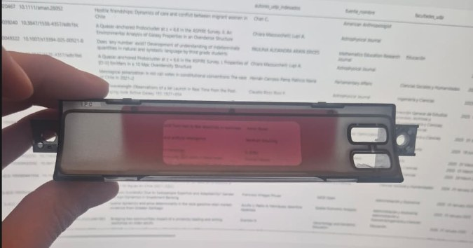

# 01 — Hardware

Components, exact per-stage values, pin maps, wiring and assembly for both nodes.
See [`docs/00-concept/`](../00-concept/README.md) for purpose and architecture.

- [`node-b-gauge.md`](node-b-gauge.md) — Node B (gauge): stages and exact values, schematics, physical layout, pin map
- [`node-a-locking.md`](node-a-locking.md) — Node A (locking): stages and exact values, logic, schematics, physical layout, pin map
- [`assembly-and-wiring.md`](assembly-and-wiring.md) — i59 adapter, connectors, the carrier board, cable lengths, consumables and tools
- [`diagrams/`](diagrams/) — the ten figures (PNG, dark-mode native); regenerate with [`scripts/generate_diagrams.py`](../../scripts/generate_diagrams.py)
- [`photos/`](photos/) — reference photographs of the vehicle's OEM parts

The KiCad / EasyEDA project — for the v0.2 PCB, see [`ROADMAP.md`](../../ROADMAP.md) — will live in `/hardware` at the repository root, not here.

## Component catalogue

What each part is, what it does, and how many are needed. There are two nodes;
the quantities below are for the complete set of part *types* (some are used on
both nodes — see each node's stages for the per-node detail).

- **ESP32 DevKit V1 ×2** — *the brain of each node.* Microcontroller with Wi-Fi/Bluetooth (used for ESP-NOW), 3.3 V logic. Node B reads SSM2 and drives the display; Node A fires the relays. Powered with 5 V on its 5V pin.
- **OLED SSD1322 3.12" ×1** — *the display.* 256×64 mono, SPI, 3.3 V. Amber, to read better through the OEM red filter. Active area ≈79 × 21 mm, ≈6 mm deep.
- **RTC DS3231 ×1** — *timekeeping without draining the battery.* Real-time clock with its own cell: holds the time for years without drawing from the car. I²C. The ESP32 reads the time at power-up.
- **L9637D K-line transceiver ×1** — *translator between the engine and the ESP32.* Converts between the 12 V K-line bus (SSM2) and the ESP32's 3.3 V UART. This is what makes reading the ECU possible. Recommended on a breakout with labelled pads.
- **Recom R-78E5.0-1.0 (12→5 V) ×2** — *the power supply.* Encapsulated switching regulator, drop-in for the 7805 (IN·GND·OUT), 6.5–32 V in, fixed 5.0 V / 1 A out, no adjustment and no heat. Fit-and-forget. Cheaper alternative: MP1584EN (must be trimmed to 5.00 V with a multimeter).
- **2-channel relay module ×1** — *pulses the BIU lines.* Two opto-isolated relays (5 V coil, 10 A contacts). The dry contact isolates the ESP32 and handles whatever the BIU line carries. One channel locks, the other unlocks.
- **Schottky SS34 ×2** — *reverse-polarity protection.* One-way diode in series with the +12 V. If + and − are ever swapped, no current passes and the circuit survives.
- **TVS SMAJ18A ×2** — *transient absorber.* Suppressor diode that clips the electrical system's voltage spikes (load dump). Sits from the 12 V rail to ground; protects everything downstream.
- **Capacitors (assortment)** — *reserve and filtering.* The large electrolytic stabilises the rail and absorbs the Wi-Fi current spikes; the 100 nF ceramics clean up high-frequency noise. Assortment: 4× 470 µF (2× 35 V + 2× 16 V), ~10× 100 nF, 2× 1 nF, 2× 1 µF.
- **Resistors (assortment)** — *scale 12 V down to 3.3 V.* The 10k/3.3k and 10k/20k pairs bring 12 V or 5 V signals into the ESP32's safe 3.3 V range, for sensing ignition, illumination and analogue sensors. Assortment: 10k ×6, 3.3k ×3, 20k ×2, 510 Ω ×2.
- **BAT85 clamp diodes ×6** — *the safety ceiling.* Clips anything above 3.3 V before it reaches an ESP32 pin. The last line of defence on the inputs.
- **Posi-Tap / iWire (iWire ×3)** — *clean, reversible joints.* Posi-Tap connects to a car wire without cutting it, better than a "quick-splice". The iWire i59 connectors (1 male + 2 female) build the gauge's reversible adapter. Posi-Tap: as many as needed.
- **2 A fuse + holder ×2** — *protects the harness.* Sacrifices itself on a short and cuts the current before the loom is damaged. On every 12 V feed, no exceptions.

## BOM with indicative prices

CLP = Chilean retail; USD = AliExpress/Mouser. No VSS parts — removed, see
[ADR 0002](../decisions/0002-speed-over-ssm2-not-vss.md). Passives are listed
with exact values.

| Item | Value / spec | Qty | ≈ Price | Where |
| --- | --- | --- | --- | --- |
| ESP32 DevKit V1 | WROOM-32, 30 pin | 2 | $7k CLP ea | CL retail / Ali |
| OLED SSD1322 3.12" | 256×64 SPI amber — colour still open, see below | 1 | US$18–28 | Ali / Amazon |
| RTC DS3231 | module + coin cell | 1 | $2–3k CLP | CL retail |
| L9637D breakout | K-line ISO 9141 | 1 | US$4–10 | Ali / Mouser |
| Buck **Recom R-78E5.0-1.0** | encapsulated switcher 5 V/1 A · drop-in 7805 · in 6.5–32 V (budget alt: MP1584EN) | 2 | US$6–9 ea | Mouser / DigiKey |
| 2-ch relay module | opto, 5 V coil, 10 A | 1 | $4–6k CLP | CL retail |
| Schottky SS34 | 3 A / 40 V | 2 | $1k | CL retail / Ali |
| TVS SMAJ18A | unidirectional 400 W | 2 | $1k | Ali / Mouser |
| Electrolytics | 470 µF/35 V and 470 µF/16 V | 4 | $2k | CL retail |
| Ceramics | 100 nF ×10, 1 nF ×2, 1 µF ×2 | set | $2k | CL retail |
| Resistors | 10k ×6, 3.3k ×3, 20k ×2, 510 Ω ×2 | set | $2k | CL retail |
| Clamp diodes | BAT85 ×6 (or 5.1 V zener) | set | $2k | CL retail / Ali |
| Fuses + holders | 2 A inline | 2 | $2k | auto parts |
| i59 connectors | 1 male + 2 female | 3 | US$5–12 ea | iWire |
| **Double-sided perfboard** (carrier) | FR4 2.54 mm, 5-size kit + M/F headers — **use 3 × 7 cm (11 × 27 holes) for both nodes** | 1 kit | US$10–15 | [Amazon kit](https://www.amazon.com/Soldering-Electronic-Compatible-Ar-duino-Connector/dp/B0948VC6P4) / Ali / ML |
| Wire, heatshrink, Posi-Tap, enclosure, grommets | assembly | — | $15k CLP | local |
| (Future) MAX31855 | type-K thermocouple amp | 0–1 | US$5 | Ali |

*Prices are as recorded in the v0.1 source document. They have not been verified
or refreshed.*

### Display colour: amber or white, still open

The BOM specifies an **amber** OLED, and the v0.1 source document justified that
by saying it passes better through a red OEM filter. That justification is now in
question.

The lens of the donor unit, photographed in transmission against a white screen
([`donor-lens-backlit.jpg`](photos/donor-lens-backlit.jpg)), shows a clear red /
burgundy band across the display window. But the unit installed in the car reads
**white** when lit, as does the head unit below it — the red elements on that part
of the dash are the surrounding button legends and knob rings, not the displays.

**Photo** — The donor lens in transmission: a red / burgundy band across the
display window, smoked grey around it.

Those two facts have not been reconciled, and the donor is the base clock-only
trim, so its lens may simply not be the same part as the car's. **The choice
between an amber and a white OLED is therefore not settled**, and the BOM row
above should be read as provisional. It is tracked as an
[open check](../04-integration/README.md#open-checks-on-the-vehicle).

### Perfboard size: correction to the source document

**Both nodes use a 3 × 7 cm board (11 × 27 holes at 2.54 mm pitch).** Confirmed by
the project author; the BOM row above has been corrected accordingly.

The v0.1 source document contradicted itself here, and the contradiction is worth
recording because it is easy to reintroduce. Its BOM row read "7 × 9 cm for Node B,
5 × 7 cm for Node A", while the layout figures for *both* nodes were drawn on a
3 × 7 cm board — which at 2.54 mm pitch is exactly the 11 × 27 hole grid the Node B
plan is titled with (11 × 2.54 ≈ 28 mm, 27 × 2.54 ≈ 69 mm). "3 × 7 cm" and
"11 × 27 holes" are two ways of stating the same board; the BOM row was simply wrong.

The figures ([Fig. 5](node-b-gauge.md#exact-plan-on-the-perfboard-grid),
[Fig. 9](node-a-locking.md#grid-plan)) are therefore the authority on board
dimensions, and Node B's grid plan is the density check: everything has to fit in
those 11 × 27 holes, with row 26 left empty between the two header rows.

## Wire colour code

Used consistently across every figure and every stage table:

| Colour | Net |
| --- | --- |
| Yellow | +12 V |
| Copper / orange | +5 V |
| Red | +3.3 V |
| Grey | GND |
| Blue | Signal |
| Cyan | ESP-NOW (radio, no wire) |
