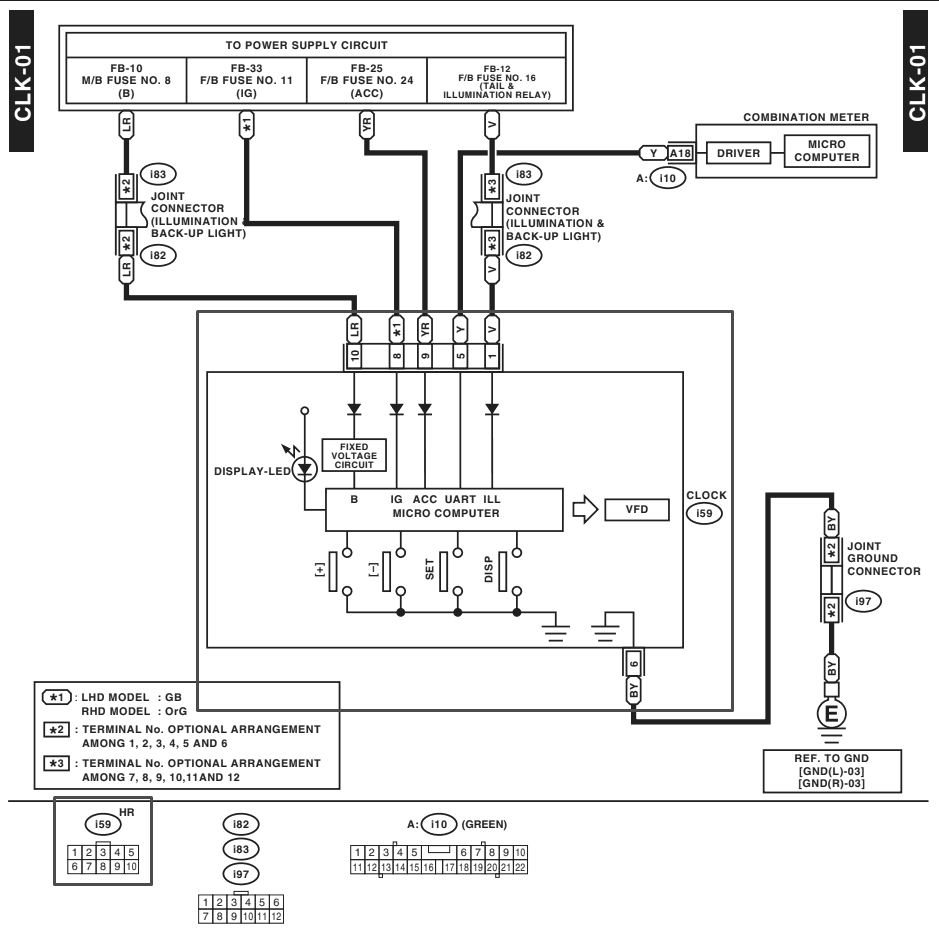

# Assembly, wiring and consumables

Owns the **physical build**: the i59 adapter, connector standard, carrier board,
cable schedule, consumables and tools. Per-stage component values are in each
node's own page.

## i59 adapter (1 male + 2 female)

A pass-through adapter: **the harness is never cut.** Every OEM signal passes
straight through from the car's connector to a second female connector, and the
module taps what it needs in parallel. The K-line comes in separately from the OBD
port and travels on a pin the factory circuit does not use.

### What the factory circuit actually puts on this connector

**Figure** — Factory wiring diagram CLK-01. The clock (i59) is the block outlined
in red; its connector view, a 2 × 5 with pins 1–5 on the top row and 6–10 on the
bottom, is outlined at the bottom left. See
[reference material](reference/README.md) for provenance and licensing.

The OEM clock is fed by **four separate supplies**, talks to the combination meter
over a serial line, and grounds through a joint connector. The four buttons at the
bottom of the module — **[+], [−], SET, DISP** — all switch to ground, which is the
same topology [ADR 0004](../decisions/0004-reuse-oem-contact-pad-buttons.md)
depends on.

| Pin | Wire code | Fed from / goes to | Role in the OEM circuit |
| --- | --- | --- | --- |
| **1** | V | F/B fuse 16, tail & illumination relay | ILL — display dimming |
| **2** | — | — | not used by this circuit |
| **3** | — | — | not used by this circuit |
| **4** | — | — | not used by this circuit |
| **5** | Y | combination meter, connector i10 pin A18 | UART between clock and cluster |
| **6** | BY | joint ground connector i97 | GND |
| **7** | — | — | not used by this circuit |
| **8** | GB (LHD) / OrG (RHD) | F/B fuse 11 | IG — ignition-switched supply |
| **9** | YR | F/B fuse 24 | ACC |
| **10** | LR | M/B fuse 8 | B — constant supply, keeps the clock running with the key out |

Wire codes are as printed on the diagram and still need visual confirmation on the
actual connector — one of the [open checks](../04-integration/README.md#open-checks-on-the-vehicle).
Note that **pin 8's colour differs between LHD and RHD**; this car is LHD, so IG is
the GB wire.

### What the adapter does with each pin

| i59 pin | Signal | Female #1 (car) | Male / Female #2 (module) |
| --- | --- | --- | --- |
| 8 | IG 12 V | ✔ pass-through | ✔ supply |
| 6 | GND | ✔ pass-through | ✔ common ground |
| 1 | ILL | ✔ pass-through | ✔ dimming |
| 7 | **K-line** (new) | — empty | ✔ from OBD pin 7 |
| 2 / 3 | — | — empty | — spare. *(These were once earmarked for analogue sensors. After the v0.1.8 split the i59 reaches B-PWR, whose J6 carries only IG, GND and ILL, while the sensor input is J5 on B-GAUGE in the clock bay — there is no path from these pins to an ADC.)* |
| 4 | — | — empty | — spare |
| 10 | constant B+ | ✔ pass-through | ✖ **deliberately not connected** |
| 5 | OEM UART | ✔ pass-through | ✖ **not connected, not driven** |
| 9 | ACC | ✔ pass-through | ◦ optional / future |

> ⚠️ **Unresolved: does the K-line go through the adapter, or beside it?**
> The pin table above routes it on i59 pin 7, so it arrives inside the adapter.
> The [cable schedule](#cable-lengths) and [Fig. 1](../00-concept/README.md#architecture)
> route it on its own cable from the OBD port instead. Both are buildable and
> neither is wrong on its own; the source document contains both.
>
> **Moving the transceiver to B-PWR narrowed this but did not close it.** Since
> v0.1.8 the K wire terminates at B-PWR's J7 either way, and B-PWR sits at the
> i59 — so the layout no longer disagrees with the pin table, and the choice is now
> only about how the wire gets there. Through the adapter is tidier and puts one
> fewer cable in the console; beside it is simpler to fault-find and leaves the
> adapter a pure pass-through. **Recorded rather than silently reconciled**
> ([CONTRIBUTING](../../CONTRIBUTING.md#what-must-not-be-silently-fixed)), and to be
> settled before the adapter is built — step 4 of the
> [install sequence](../04-integration/README.md#install-sequence).

### Why this makes the modification reversible

The diagram is what turns "reversible" from a claim into something checkable.

**The four unused pins are genuinely unused.** The clock circuit puts nothing on
pins 2, 3, 4 or 7. If the K-line is routed through the adapter it therefore rides
on a terminal carrying no factory signal at all — it cannot interfere with
anything, because there is nothing there to interfere with. The argument below
holds either way: it depends on the adapter passing every factory signal through,
not on what the spare pins carry.

**Nothing is cut, spliced or tapped.** Every factory signal is carried from the
car's connector to the second female connector unbroken. Unplug the adapter,
reconnect the OEM clock, and the circuit in this diagram is exactly what it was —
there is no splice left behind, no pierced insulation, no removed terminal.

**The constant supply is declined on purpose.** The OEM clock takes B+ on pin 10
so it can keep time with the key out. This system does not: it is fed from IG only
and dies with the ignition, and time is held by the DS3231's own cell. That is the
[zero parasitic draw](../00-concept/README.md#zero-parasitic-draw) principle made
concrete — pin 10 is passed through to the OEM connector and simply not taken by
the module.

> ⚠️ **Pin 5 is a live serial link to the combination meter.** The diagram shows it
> going to connector i10 pin A18 and into the cluster's own microcontroller. The
> adapter passes it through and **must not drive it**: putting anything on that line
> risks disturbing the instrument cluster, which is a considerably worse failure
> than a gauge that does not work. Treat it as strictly hands-off for v0.1.
>
> It is, however, an interesting thing to know exists. Listening to it passively —
> receive only, never transmit — could be a source of data the ECU does not expose
> over SSM2. That is a research item, not a plan, and it is not in any roadmap
> version.

## Wiring and connections — all serviceable

**Principle:** no expensive module is soldered down. Each one is socketed or on a
latching connector so it can be swapped without a soldering iron — the display
included. The only things soldered to the board are the sockets, the connectors
and the cheap passives. No Dupont connectors: they have no latch and vibration
walks them out.

### Method per connection

| Connection | Type | Serviceable method |
| --- | --- | --- |
| ESP32 ↔ carrier | module | socket (female headers) + removable retainer |
| **OLED ↔ carrier** | module (expensive) | latching connector or socket; **retained by the 3D-printed bezel with screws**, not by the header |
| buck · relay ↔ carrier | module | socket + removable retainer |
| **RTC ↔ B-GAUGE** | off-board module | four wires on J4 to a 3D-printed case of its own; it is not on the board |
| **L9637D ↔ B-PWR** | SO-8 on a SOIC-8→DIP-8 adapter | **machined-pin, gold-plated 8-way DIP socket** — three separable interfaces stack here, on the one part whose intermittent contact jams the car's diagnostic line |
| **B-PWR ↔ B-GAUGE** | the five-wire umbilical | latching connector at each end, 15–20 cm |
| OEM buttons ↔ carrier | bezel | latching connector (JST) so the bezel can be separated |
| Passives (dividers, K-line R/C) | discrete | soldered to the carrier (the carrier is the repairable unit) |
| i59 (to the car) | harness | pass-through adapter (already solved) |
| K-line → OBD pin 7 | harness | latching connector at B-PWR's enclosure wall |
| BIU p15 / p29 | harness | latching connector + Posi-Tap or solder at the BIU |
| 12 V (IG) / GND | harness | latching connector at the enclosure wall |
| SW1 ON/OFF switch → GPIO27 | harness | reuses the factory OrG run to the BIU; latching connector at the enclosure wall |
| LED1 tell-tale → GPIO33 | harness | same connector as SW1 (i78 pins 8–9) |

### Connectors (latching, not Dupont)

| Connector | Pitch | Latch | Best use |
| --- | --- | --- | --- |
| Dupont | 2.54 | ✗ none | avoid in a car |
| JST-XH | 2.5 | friction | signal to board |
| JST-SM | 2.5 | ✓ clip | wire-to-wire (harness disconnect) |
| JST-VH | 3.96 | friction | 12 V power |
| **Molex Micro-Fit 3.0** | 3.0 | ✓ latch | wire-to-wire at the enclosure wall — **but not on a board** |
| **Molex KK 254** | 2.54 | ✓ latch | **board headers — recommended** |

> **Micro-Fit 3.0 cannot be used for J1–J8.** Its pitch is **3.00 mm**, in both
> axes; every board here is a 2.54 mm grid. Use **Molex KK 254** (2.54 mm exactly,
> positive latch, 4 A per circuit) for board headers, or **JST-XH** — its 2.5 mm
> pitch accumulates 0.04 mm per position, which hole clearance absorbs up to about
> eight pins, so J2's seven are the practical limit. Micro-Fit stays the right
> choice **wire-to-wire at the enclosure wall**, which is where this table's
> original recommendation belonged. Nothing in either node is near any of these
> families' current limits: the largest load is 250 mA.

**One exception, from v0.3.** Node C's [bulkhead connector](node-c-sensors.md#the-bulkhead-connector)
at the firewall is environmentally sealed and therefore not from this table. The
sealing stops there: everything on the cabin side is Micro-Fit as usual.

### The carrier boards

**Fig. 10** — Layout, not a schematic. Three boards, all the same 3 × 7 cm
part: every module plugged into a socket, every wire out of the board on a
latching connector.

- **Socketing:** solder **female** headers to the carrier; the ESP32 and each
  module (with their male pins) plug in and can be pulled out.
- **Mechanical retention (the anti-vibration point):** the socket alone is not
  enough. Fix each module with a **removable retainer** — a screwed 3D-printed
  clip, a cable tie over the module, or a bead of hot glue in one corner (removed
  with alcohol when servicing). Vibration then cannot unplug it, and it stays
  serviceable.
- **Compact:** the carrier is flat and small; it eliminates loose wiring and does
  not grow the way screw-terminal shields do.
- **Three boards, not two.** Node A has one; Node B has two —
  [B-GAUGE and B-PWR](node-b-gauge.md#node-b-is-built-as-two-boards) — and all three are the
  same 3 × 7 cm part, so one printed tray design fits all of them.

### Strain relief — matters more than the connector

- Heatshrink over every joint, plus a **cable tie or bead of hot glue** fixing
  the cable to the board or enclosure so the joint cannot flex.
- A **grommet** wherever the harness leaves the enclosure.
- Optional: **conformal coating**, or a bead of silicone behind each connector and
  over the solder joints — this "freezes" everything against vibration, which is
  what industry does.
- A **bad crimp is worse than a good solder joint**: if you are not confident with
  the crimp tool, use factory pre-crimped leads.

## Cable lengths

| Run | From → to | Length | Gauge |
| --- | --- | --- | --- |
| K-line | OBD pin 7 → B-PWR | 1.2–1.5 m | 22 AWG |
| i59 ↔ B-PWR | adapter → B-PWR (IG, GND, ILL) | 15–20 cm | 22 AWG |
| **Umbilical** | B-PWR → B-GAUGE, five wires | 15–20 cm | 22 AWG |
| **RTC** | B-GAUGE J4 → DS3231 in its printed case | ≤20 cm | 26 AWG |
| LED1 tell-tale | i78 pin 8 → Node A GPIO33 | **route not established — see [`OC-07`](../04-integration/README.md#open-checks-on-the-vehicle)** | — |
| LOCK/UNLOCK | Node A → BIU p15/p29 | 15–30 cm | 20 AWG |
| IG + GND, Node A | fuse box / ground → Node A | 30–50 cm | 20 AWG |
| SW1 ON/OFF switch | console switch → Node A GPIO27 | existing OrG factory run (console → BIU) | — |
| Any node ↔ any node | ESP-NOW (radio) | 0 | — |

No VSS run: removed ([ADR 0002](../decisions/0002-speed-over-ssm2-not-vss.md)).
Buy about 30 % extra wire and leave service loops.

**Node C, from v0.3** — not part of the first build:

| Run | From → to | Length | Gauge |
| --- | --- | --- | --- |
| Caliper RTD ×2 | front caliper → bulkhead | 2.5–3 m | 3-wire, shielded |
| Coolant level | catch tank → bulkhead | 1.5–2 m | 22 AWG |
| Radiator ΔT ×2 | inlet / outlet → bulkhead | 1–1.5 m | 3-wire |
| Ambient air | bumper or engine bay → bulkhead | 1.5–2 m | 3-wire |
| Battery voltage | battery → bulkhead | 1.5–2 m | 20 AWG, fused at the battery |
| Bulkhead → Node C | firewall → node | 30–50 cm | 22 AWG |

Confirm the caliper lead length before ordering: an earlier draft assumed 1.5 m,
from when the node was to live in the engine bay.

## Consumables and tools

### Consumables (used up)

| Consumable | Specification | What it is for | Priority |
| --- | --- | --- | --- |
| Solder | 63/37 or 60/40 with flux core, Ø 0.6–0.8 mm | joining components and wires; 63/37 solidifies evenly (easier) | essential |
| Flux | no-clean pen or paste | makes the solder flow and wet properly; critical on the fine ESP32/L9637D pins | essential |
| Heatshrink | 2/3/5/10 mm assortment, **adhesive-lined** (3:1) | insulates and seals joints; the adhesive lining makes it weather-tight for a car | essential |
| Desoldering braid + pump | 2 mm braid + solder sucker | fixing mistakes and **removing the OEM components** from the clock board | essential |
| Cable ties | 100–200 mm assortment | securing looms away from moving parts and heat | essential |
| Sockets (2.54 mm female headers) | 40-pin strips, cuttable | socketing the ESP32 and modules on the carrier → drop-in serviceability | essential |
| 2.54 mm male headers | straight and right-angle | pins for modules that do not ship with them | essential |
| Latching connectors | JST-SM/XH and/or Molex Micro-Fit 3.0 + pins | every enclosure output (K-line, BIU, 12 V) — NOT Dupont | essential |
| Pre-crimped leads | factory JST/Molex leads | avoid the weak point of a bad crimp | recommended |
| Grommets | rubber, sized to the loom | seal and protect where cable leaves the enclosure | essential |
| Removable retainers | cable ties + 3D-printed clip / hot glue | hold socketed modules without soldering them (serviceable) | essential |
| Conformal coating (optional) | acrylic spray or brush | "freezes" joints and connector backs against vibration | recommended |
| Posi-Tap / Posi-Lock | 10–22 AWG | tap car wires without cutting them; reversible | essential |
| Ring terminals | for ground, 20 AWG + screw | solid chassis ground point | essential |
| Butt splices | heat-shrinkable, 20–22 AWG | joining runs with a seal | recommended |
| Split loom / spiral wrap | Ø 6–10 mm | bundling and protecting the K-line run and looms | recommended |
| Self-amalgamating + insulating tape | self-vulcanising silicone | seals over heatshrink in exposed areas | recommended |
| Isopropyl alcohol + swabs | ≥ 99 % | cleaning flux residue (prevents corrosion and bad contacts) | recommended |
| Hot glue | sticks + gun | strain relief for cables inside the enclosure | recommended |
| Kapton tape | high temperature | insulating near the 12 V stage / solder joints | recommended |
| Standoffs + screws | M2/M3 nylon | mounting boards inside the enclosure / 3D housing | recommended |
| VHB double-sided tape | 3M automotive | fixing boxes and modules to dash surfaces | recommended |
| Spare fuses | 2 A (same as the BOM) | in case they blow during testing | recommended |
| Automotive wire assortment | 20 AWG (12 V) and 22 AWG (signal), several colours | stock for every run; use a different colour per function | essential |

### Tools (not consumed, but needed)

| Tool | Use | Priority |
| --- | --- | --- |
| Temperature-controlled iron + fine tip | soldering fine pins without damaging parts (300–350 °C) | essential |
| Heat gun | shrinking heatshrink evenly (better than a lighter) | essential |
| Multimeter | checking voltages, continuity, and confirming pins on the car | essential |
| Crimp tool | JST and Micro-Fit terminals — check the die matches the connector family | essential |
| Wire strippers | stripping without nicking strands | essential |
| Side cutters + needle-nose pliers | cutting, forming and placing | essential |
| Bench supply (or a 12 V battery with a fuse) | testing each node on the bench before the car | essential |
| USB cable (per your ESP32) | flashing the firmware (later phase) | essential |
| Helping hands + magnifier | holding and seeing fine work | recommended |
| Precision screwdrivers | opening the 85201AG200 and mounting boards | recommended |
| Label maker / tape | marking every wire by function (prevents errors) | recommended |

> **Field notes for a non-specialist.**
> - **63/37 leaded solder** is easier for a beginner than lead-free — it melts
>   lower and more evenly. Wash your hands afterwards.
> - **Colour by function.** One colour per *function*, not per net: with six reels and three boards, several colours necessarily carry more than one net, and the cut lists are what disambiguate them.
>   Label the ends. That alone prevents most wiring mistakes.
> - **Use the project's [colour code](README.md#wire-colour-code)** — yellow +12 V,
>   copper +5 V, red +3.3 V, grey GND, blue signal — not the generic automotive
>   "red = 12 V". Every figure in this repository assumes it.
