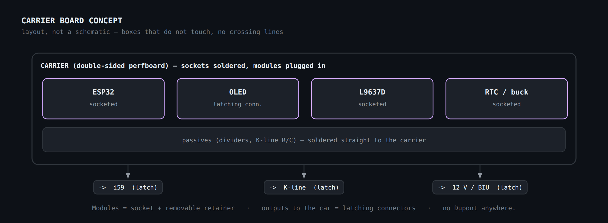

# Assembly, wiring and consumables

## i59 adapter (1 male + 2 female)

A pass-through adapter: the harness is never cut. The OEM signals pass straight
through; the K-line comes in from the OBD port and travels on pin 7, which is
free on the original i59 connector.

| i59 pin | Signal | Female #1 (car) | Male / Female #2 (module) |
| --- | --- | --- | --- |
| 8 | IG 12 V | ✔ | ✔ supply + ignition sense |
| 6 | GND | ✔ | ✔ common ground |
| 1 | ILL | ✔ | ✔ dimming |
| 7 | **K-line** (new) | — empty | ✔ from OBD p7 |
| 2/3 | analogue (new) | — empty | ◦ sensors |
| 10 | constant B+ | ✔ | ✖ do not connect |
| 9 / 5 | ACC / OEM UART | ✔ | ◦ optional / future |

## Wiring and connections — all serviceable

**Principle:** no expensive module is soldered down. Each one is socketed or on a
latching connector so it can be swapped without a soldering iron — the display
included. The only things soldered to the board are the sockets, the connectors
and the cheap passives. No Dupont connectors: they have no latch and vibration
walks them out.

### Method per connection

| Connection | Type | Serviceable method |
| --- | --- | --- |
| ESP32 ↔ carrier | module | socket (female headers) + removable retainer |
| **OLED ↔ carrier** | module (expensive) | latching connector or socket; **retained by the 3D-printed bezel with screws**, not by the header |
| RTC · L9637D · buck · relay ↔ carrier | module | socket + removable retainer |
| OEM buttons ↔ carrier | bezel | latching connector (JST) so the bezel can be separated |
| Passives (dividers, K-line R/C) | discrete | soldered to the carrier (the carrier is the repairable unit) |
| i59 (to the car) | harness | pass-through adapter (already solved) |
| K-line → OBD pin 7 | harness | latching connector at the enclosure wall |
| BIU p15 / p29 | harness | latching connector + Posi-Tap or solder at the BIU |
| 12 V (IG) / GND | harness | latching connector at the enclosure wall |
| SW1 ON/OFF switch → GPIO27 | harness | latching connector at the enclosure wall |

### Connectors (latching, not Dupont)

| Connector | Pitch | Latch | Best use |
| --- | --- | --- | --- |
| Dupont | 2.54 | ✗ none | avoid in a car |
| JST-XH | 2.5 | friction | signal to board |
| JST-SM | 2.5 | ✓ clip | wire-to-wire (harness disconnect) |
| JST-VH | 3.96 | friction | 12 V power |
| **Molex Micro-Fit 3.0** | 3.0 | ✓ latch | signal + power — **recommended** |

### The carrier board, per node

**Fig. 10** — Layout, not a schematic: boxes that do not touch, no crossing
lines. Every module plugged in, latching connectors at the edge.

- **Socketing:** solder **female** headers to the carrier; the ESP32 and each
  module (with their male pins) plug in and can be pulled out.
- **Mechanical retention (the anti-vibration point):** the socket alone is not
  enough. Fix each module with a **removable retainer** — a screwed 3D-printed
  clip, a cable tie over the module, or a bead of hot glue in one corner (removed
  with alcohol when servicing). Vibration then cannot unplug it, and it stays
  serviceable.
- **Compact:** the carrier is flat and small; it eliminates loose wiring and does
  not grow the way screw-terminal shields do.

> **Replaceable display.** The OLED connects to the carrier through a **latching
> connector (JST) or a socket**, and is **held mechanically by the 3D-printed
> bezel with screws** — never hanging from its pins. If it fails: pull the bezel,
> unplug, plug in the new OLED. Five minutes, no soldering iron.

### Strain relief — matters more than the connector

- Heatshrink over every joint, plus a **cable tie or bead of hot glue** fixing
  the cable to the board or enclosure so the joint cannot flex.
- A **grommet** wherever the harness leaves the enclosure.
- Optional: **conformal coating**, or a bead of silicone behind each connector and
  over the solder joints — this "freezes" everything against vibration, which is
  what industry does.
- A **bad crimp is worse than a good solder joint**: if you are not confident with
  the crimp tool, use factory pre-crimped leads.

## Cable lengths

| Run | From → to | Length | Gauge |
| --- | --- | --- | --- |
| K-line | OBD pin 7 → gauge module | 1.2–1.5 m | 22 AWG |
| i59 ↔ module | adapter → gauge ESP32 | 15–20 cm | 22 AWG |
| LOCK/UNLOCK | Node A → BIU p15/p29 | 15–30 cm | 20 AWG |
| IG + GND, Node A | fuse box / ground → Node A | 30–50 cm | 20 AWG |
| SW1 ON/OFF switch | console switch → Node A GPIO27 | to be measured on the car | 22 AWG |
| Node A ↔ Node B | ESP-NOW (radio) | 0 | — |

No VSS run: removed ([ADR 0002](../decisions/0002-speed-over-ssm2-not-vss.md)).
Buy about 30 % extra wire and leave service loops.

## Consumables and tools

### Consumables (used up)

| Consumable | Specification | What it is for | Priority |
| --- | --- | --- | --- |
| Solder | 63/37 or 60/40 with flux core, Ø 0.6–0.8 mm | joining components and wires; 63/37 solidifies evenly (easier) | essential |
| Flux | no-clean pen or paste | makes the solder flow and wet properly; critical on the fine ESP32/L9637D pins | essential |
| Heatshrink | 2/3/5/10 mm assortment, **adhesive-lined** (3:1) | insulates and seals joints; the adhesive lining makes it weather-tight for a car | essential |
| Desoldering braid + pump | 2 mm braid + solder sucker | fixing mistakes and **removing the OEM components** from the clock board | essential |
| Cable ties | 100–200 mm assortment | securing looms away from moving parts and heat | essential |
| Sockets (2.54 mm female headers) | 40-pin strips, cuttable | socketing the ESP32 and modules on the carrier → drop-in serviceability | essential |
| 2.54 mm male headers | straight and right-angle | pins for modules that do not ship with them | essential |
| Latching connectors | JST-SM/XH and/or Molex Micro-Fit 3.0 + pins | every enclosure output (K-line, BIU, 12 V) — NOT Dupont | essential |
| Pre-crimped leads | factory JST/Molex leads | avoid the weak point of a bad crimp | recommended |
| Grommets | rubber, sized to the loom | seal and protect where cable leaves the enclosure | essential |
| Removable retainers | cable ties + 3D-printed clip / hot glue | hold socketed modules without soldering them (serviceable) | essential |
| Conformal coating (optional) | acrylic spray or brush | "freezes" joints and connector backs against vibration | recommended |
| Posi-Tap / Posi-Lock | 10–22 AWG | tap car wires without cutting them; reversible | essential |
| Ring terminals | for ground, 20 AWG + screw | solid chassis ground point | essential |
| Butt splices | heat-shrinkable, 20–22 AWG | joining runs with a seal | recommended |
| Split loom / spiral wrap | Ø 6–10 mm | bundling and protecting the K-line run and looms | recommended |
| Self-amalgamating + insulating tape | self-vulcanising silicone | seals over heatshrink in exposed areas | recommended |
| Isopropyl alcohol + swabs | ≥ 99 % | cleaning flux residue (prevents corrosion and bad contacts) | recommended |
| Hot glue | sticks + gun | strain relief for cables inside the enclosure | recommended |
| Kapton tape | high temperature | insulating near the 12 V stage / solder joints | recommended |
| Standoffs + screws | M2/M3 nylon | mounting boards inside the enclosure / 3D housing | recommended |
| VHB double-sided tape | 3M automotive | fixing boxes and modules to dash surfaces | recommended |
| Spare fuses | 2 A (same as the BOM) | in case they blow during testing | recommended |
| Automotive wire assortment | 20 AWG (12 V) and 22 AWG (signal), several colours | stock for every run; use a different colour per function | essential |

### Tools (not consumed, but needed)

| Tool | Use | Priority |
| --- | --- | --- |
| Temperature-controlled iron + fine tip | soldering fine pins without damaging parts (300–350 °C) | essential |
| Heat gun | shrinking heatshrink evenly (better than a lighter) | essential |
| Multimeter | checking voltages, continuity, and confirming pins on the car | essential |
| Crimp tool | terminals + **Dupont pins** (Dupont needs its specific die) | essential |
| Wire strippers | stripping without nicking strands | essential |
| Side cutters + needle-nose pliers | cutting, forming and placing | essential |
| Bench supply (or a 12 V battery with a fuse) | testing each node on the bench before the car | essential |
| USB cable (per your ESP32) | flashing the firmware (later phase) | essential |
| Helping hands + magnifier | holding and seeing fine work | recommended |
| Precision screwdrivers | opening the 85201AG200 and mounting boards | recommended |
| Label maker / tape | marking every wire by function (prevents errors) | recommended |

> **Field notes for a non-specialist.**
> - **Adhesive-lined heatshrink** (not the plain kind): a car vibrates and takes
>   in moisture; the adhesive wall seals the copper.
> - **63/37 leaded solder** is easier for a beginner than lead-free — it melts
>   lower and more evenly. Wash your hands afterwards.
> - **Colour by function:** red = 12 V, black = ground, another colour per signal.
>   Label the ends. That alone prevents 90 % of mistakes.
> - **No "quick-splice" connectors that pierce the wire:** they fail with
>   vibration. Use Posi-Tap, or solder plus heatshrink.
