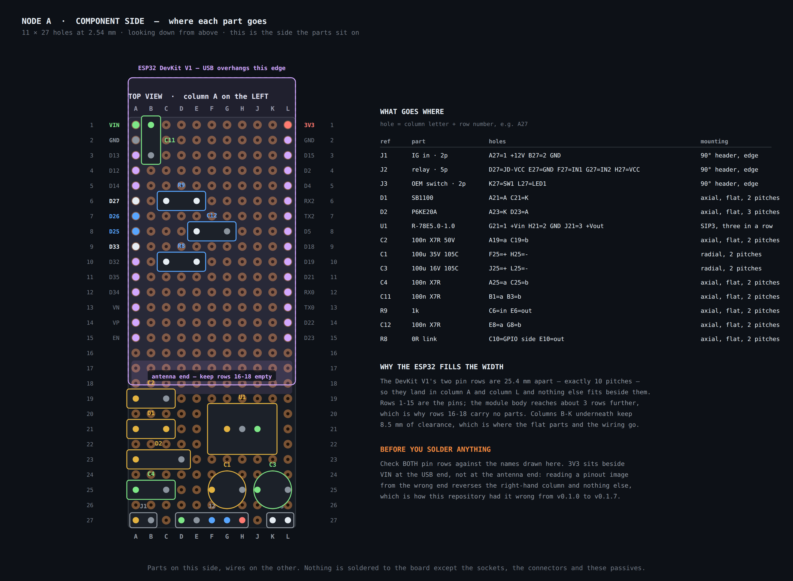
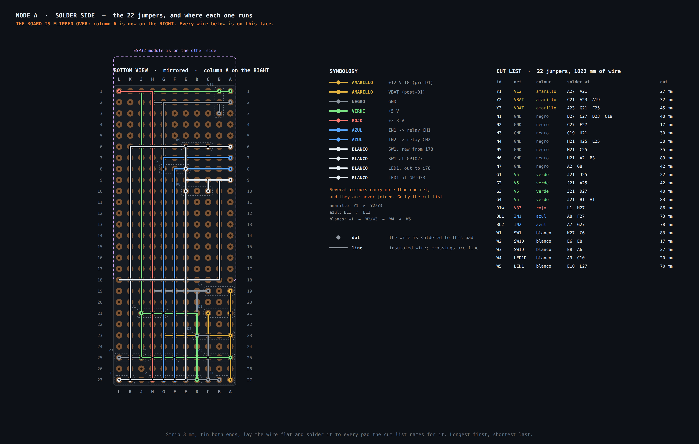
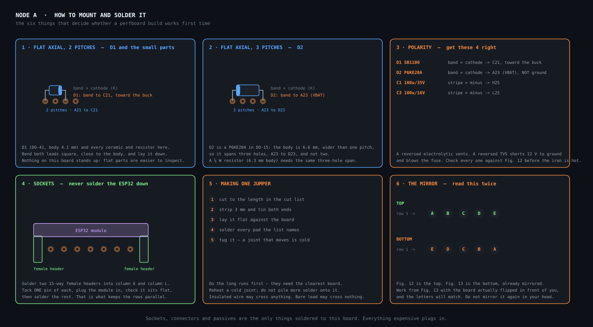

# Node A — building the board

Hole-by-hole assembly for the Node A carrier: where every part goes, every jumper
on the solder side, and the order to do it in. Component values are in
[`node-a-locking.md`](node-a-locking.md); this page is the physical build.

Written for someone comfortable with electronics who has not wired a perfboard at
this density before.

> **This page was rebuilt in v0.1.8.** The right-hand header column was indexed
> from the wrong end of the module, the power-stage parts overlapped one another
> physically, and the 5 V reservoir exceeded the buck's maximum capacitive load.
> All three are fixed below, and the build script now refuses layouts with those
> defects. If you have an older printout, discard it.

## The board and how holes are named

**3 × 7 cm double-sided perfboard, 11 × 27 holes at 2.54 mm.**

Columns are lettered **A B C D E F G H J K L** — the letter I is skipped so it
cannot be read as a 1. Rows are numbered **1 to 27, row 1 at the USB end**. A hole
is a letter plus a number: `A27` is the bottom-left corner, `L1` the top-right.

> **A hole is not a reference designator.** Hole `C12` is column C, row 12.
> Capacitor `C12` is the 100 nF on the switch input, and it lives in holes `E8`
> and `G8`. The tables always give holes in the *holes* column.

Three facts decide the whole layout, and all three are measurements:

| | |
| --- | --- |
| The DevKit V1's pin rows are **25.4 mm apart — exactly 10 pitches** | so they land in column A and column L, and the module fills the board's width |
| Each row is **15 pins** | so the module owns rows 1–15 |
| The module body reaches **~8 mm past the end pins** | so rows 16–18 carry no parts, and the PCB antenna sits over them |

The nine columns between the headers are covered by the module on top but keep
**8.5 mm of clearance** underneath. Flat parts and all the wiring go there.

### Which way round the module is

**`VIN` and `3V3` are the pair at the USB end**, one on each row; `EN` and `D23`
are the pair at the antenna end. That single fact decides every hole in column L.

This repository had it backwards from v0.1.0 to v0.1.7, because pinout diagrams
for this board are published with the USB at the top in some sources and at the
bottom in others, and reading one from the wrong end reverses the right-hand
column and nothing else. It is now [held in one
place](../../scripts/board_lib.py) and verified against four machine-readable
sources. **Check it against your own board's silkscreen anyway** — the 30-pin
form factor is widely cloned.

## Wire colours

Six colours, one job each. The figure colours match the wire you will cut.

| Wire | Carries |
| --- | --- |
| **Amarillo** | +12 V — the raw IG line and VBAT after D1 |
| **Negro** | GND |
| **Verde** | +5 V, buck output |
| **Rojo** | +3.3 V, from the ESP32's own regulator |
| **Azul** | the two relay drives — IN1, IN2 |
| **Blanco** | the four wires that run to the OEM switch — SW1 and LED1, each on both sides of its series part |

> **Several colours carry more than one net, and they are never joined.** Go by
> the cut list, not by the colour: the cut list is what says which pads belong to
> which piece of wire.

This differs from the [figure colour code](README.md#wire-colour-code) in one
place: +5 V is **verde** here because copper-coloured wire is not in the box.

## Read this before the iron is hot

1. **Check both pin rows against Fig. 12.** `3V3` sits beside `VIN` at the USB
   end. If your board disagrees, stop — nothing on this page will be right.
2. **The axial substitutes changed in v0.1.8.** D1 is now **SB1100** (1 A, 100 V,
   DO-41) and D2 is **P6KE20A** (DO-15, 3-pitch footprint). The old suggestions
   were unbuildable: a 1N5822's DO-201AD leads are 1.2–1.3 mm and will not enter a
   1 mm perfboard hole, and a DO-15 body is 6.6 mm long against a 5.08 mm span.
   SB1100 also brings 100 V of reverse rating, which matters because D2 sits
   behind D1 and cannot protect it from negative transients.
3. **Both electrolytics are 100 µF, not 470 µF.** The Recom's maximum capacitive
   load is **220 µF** and C3 sits on its output; 470 µF is twice the limit and
   makes the module hiccup into it at start-up. 100 µF also fits the space and
   cuts the fuse inrush.
4. **Specify the dielectric.** C2, C4, C11 and C12 are **X7R**; a Y5V part of the
   same marking loses 82 % of its capacitance by −30 °C, which is exactly when the
   crank transient arrives. C2 is **50 V** — it sits on VBAT, which D2 clamps at
   up to 27.7 V.
5. **Both electrolytics are 105 °C parts.** At a 70 °C console ambient an 85 °C /
   1000 h capacitor is a five-year component; a 105 °C / 2000 h part lasts eight
   times longer for a few cents.
6. **The fuse is 1 A slow-blow**, not 2 A. The node draws about 215 mA; 1 A is
   three times the load and half the fault current, and the 100 µF inrush
   (I²t ≈ 0.02 A²s) is nowhere near a 1 A time-lag fuse's melting I²t.
7. **Leave the row-1 edge reachable.** The USB connector overhangs it, and the
   first flash and any recovery go through it
   ([ADR 0005](../decisions/0005-ota-in-maintenance-mode.md)).

## Component side

**Fig. 12** — Every part in the hole it goes in, with its body drawn to scale.
The outlines are what settle the clearances; the hole list is what you solder to.

| ref | part | mounting | holes |
| --- | --- | --- | --- |
| J1 | IG in · 2p | 90° header, edge | `A27`=1 +12V `B27`=2 GND |
| J2 | relay · 5p | 90° header, edge | `D27`=JD-VCC `E27`=GND `F27`=IN1 `G27`=IN2 `H27`=VCC |
| J3 | OEM switch · 2p | 90° header, edge | `K27`=SW1 `L27`=LED1 |
| D1 | SB1100 | axial, flat, 2 pitches | `A21`=A `C21`=K |
| D2 | P6KE20A | axial, flat, 3 pitches | `A23`=K `D23`=A |
| C2 | 100 nF X7R 50 V | axial, flat, 2 pitches | `A19`=a `C19`=b |
| U1 | R-78E5.0-1.0 | SIP3, three in a row | `G21`=1 +Vin `H21`=2 GND `J21`=3 +Vout |
| C1 | 100 µF 35 V 105 °C | radial, 2 pitches | `F25`=+ `H25`=− |
| C3 | 100 µF 16 V 105 °C | radial, 2 pitches | `J25`=+ `L25`=− |
| C4 | 100 nF X7R | axial, flat, 2 pitches | `A25`=a `C25`=b |
| C11 | 100 nF X7R | axial, flat, 2 pitches | `B1`=a `B3`=b |
| R9 | 1 kΩ | axial, flat, 2 pitches | `C6`=in `E6`=out |
| C12 | 100 nF X7R | axial, flat, 2 pitches | `E8`=a `G8`=b |
| R8 | **0 Ω link** | axial, flat, 2 pitches | `C10`=GPIO side `E10`=out |

Four of these are new in v0.1.8 and are worth a sentence each:

- **C2, C4 and C11** are the decoupling the board never had. C11 sits across the
  module's `VIN` and `GND` pins — it is the input capacitor of the DevKit's own
  regulator, and it supplies the step that regulator pulls from the 5 V rail when
  the radio transmits, which C3 cannot do from the other end of two jumpers.
- **R8 is a footprint, not a value.** The tell-tale on i78 pins 8–9 is drawn as an
  LED on the factory diagram, but nothing has measured it: it may be a lamp, and
  if it is an LED nobody knows whether its series resistor is inside the switch
  body. Fit a **0 Ω link** so the position exists, and put a real value in only
  after [`OC-07`](../04-integration/README.md#open-checks-on-the-vehicle) measures
  the load. Without the footprint, adding one later is rework.
- **R9 and C12** condition SW1. It is the only input that leaves the enclosure and
  runs metres of factory harness through the dash, terminated by nothing but the
  ESP32's ~45 kΩ internal pull-up. 1 kΩ in series and 100 nF at the pin costs two
  parts and turns that into a non-event.

## Solder side

**Fig. 13** — The 22 jumpers, mirrored: **column A is on the right**.

| id | net | colour | solder at | cut | what it does |
| --- | --- | --- | --- | --- | --- |
| `Y1` | V12 | amarillo | `A27` `A21` | 27 mm | J1 → D1 anode |
| `Y2` | VBAT | amarillo | `C21` `A23` `A19` | 32 mm | D1 K → D2 K → C2 |
| `Y3` | VBAT | amarillo | `A23` `G21` `F25` | 45 mm | → U1 +Vin → C1 + |
| `N1` | GND | negro | `B27` `C27` `D23` `C19` | 40 mm | J1 GND → spine → D2 A → C2 |
| `N2` | GND | negro | `C27` `E27` | 17 mm | spine → relay GND |
| `N3` | GND | negro | `C19` `H21` | 30 mm | → U1 GND |
| `N4` | GND | negro | `H21` `H25` `L25` | 30 mm | → C1 −, C3 − |
| `N5` | GND | negro | `H21` `C25` | 35 mm | → C4 |
| `N6` | GND | negro | `H21` `A2` `B3` | 83 mm | → ESP32 GND, C11 |
| `N7` | GND | negro | `A2` `G8` | 42 mm | → C12 |
| `G1` | V5 | verde | `J21` `J25` | 22 mm | U1 out → C3 + |
| `G2` | V5 | verde | `J21` `A25` | 42 mm | → C4 |
| `G3` | V5 | verde | `J21` `D27` | 40 mm | → relay JD-VCC |
| `G4` | V5 | verde | `J21` `B1` `A1` | 83 mm | → C11 → ESP32 VIN |
| `R1w` | V33 | rojo | `L1` `H27` | 86 mm | ESP32 3V3 → relay VCC |
| `BL1` | IN1 | azul | `A8` `F27` | 73 mm | GPIO25 → relay IN1 |
| `BL2` | IN2 | azul | `A7` `G27` | 78 mm | GPIO26 → relay IN2 |
| `W1` | SW1 | blanco | `K27` `C6` | 83 mm | i78 pin 1 → R9 |
| `W2` | SW1D | blanco | `E6` `E8` | 17 mm | R9 → C12 |
| `W3` | SW1D | blanco | `E8` `A6` | 27 mm | → GPIO27 |
| `W4` | LED1D | blanco | `A9` `C10` | 20 mm | GPIO33 → R8 |
| `W5` | LED1 | blanco | `E10` `L27` | 70 mm | R8 → i78 pin 8 |

**22 jumpers, 1023 mm of wire.** `C27` is a bare pad used only as the ground
junction, so no pad carries more than two wires and a lead.

## How to mount and solder it

**Fig. 14** — Mounting, polarity, sockets, making a jumper, and the mirror rule.

## Order of work

Each stage ends in a measurement. **If the measurement is wrong, stop and fix it
before the next stage.**

### 1 · Sockets and connectors

Two 15-way female headers in column A and column L; J1, J2 and J3 as 90° headers
on row 27. Tack **one** pin of each 15-way header, plug the module in, check it
sits flat and square, then solder the rest.

Do not fit the ESP32 for the next stage.

### 2 · Power stage, no ESP32 fitted

Fit D1, D2, C2, C1, U1, C3, C4 and runs `Y1 Y2 Y3 N1 N2 N3 N4 N5`.

**Measure:** 12 V on J1 pin 1 through the 1 A fuse → `J21` reads **5.0 V ±0.1 V**.
`A23` (VBAT) reads **11.7–11.9 V** — the Schottky drops only ~0.2 V at the few
milliamps an unloaded buck takes, not the 0.4 V it drops under load. Power off,
J1 pin 1 to J1 pin 2 must read open, not short.

> **Reverse the supply leads and nothing should happen — but not for the reason
> you might assume.** D1 blocks the reverse path, so the buck stays dead. D2,
> however, is *forward*-biased in that condition and clamps VBAT about 0.9 V below
> ground, which reverse-biases C1 by the same amount. It is harmless for a few
> seconds with nothing else fitted. Do not leave it connected, and do not repeat
> this test in a later stage.

### 3 · ESP32 and the 3.3 V rail

Fit C11 and runs `G1 G2 G3 G4 N6 N7 R1w`. Plug the module in.

**Measure:** `A1` = 5.0 V, `L1` = **3.3 V**, `H27` = 3.3 V. That last one is the
relay module's logic supply and is the check that would have caught the reversed
column: with the old wiring `H27` was fed from GPIO23 and read 0 V.

### 4 · Relay outputs

Fit runs `BL1 BL2`. Connect the relay module: **JD-VCC to 5 V, VCC to 3.3 V, the
on-board jumper removed.**

**Measure:** neither relay may click at power-up or during boot, and neither may
click when the module is plugged and unplugged. Then drive GPIO25 and GPIO26 and
confirm one click each.

> **Most 2-channel opto modules are active-LOW**: pulling IN low energises the
> relay. A floating IN reads high, so the relay is off, which is the safe default —
> but check yours, because an active-HIGH module locks the doors every time the
> node boots.
>
> **At VCC = 3.3 V the opto gets about (3.3 − 1.2) / 1 kΩ ≈ 2 mA**, usually
> plenty, and when the GPIO goes high there is 0 V across the LED so *off* is
> unambiguous.
>
> **If a channel will not trip, do not move VCC to 5 V and switch the GPIO to
> open-drain.** A released open-drain pin passes no current, so the opto LED drops
> nothing and the IN node floats to the full 5 V — presented to a 3.3 V GPIO
> through the module's 1 kΩ, which pushes about 1.3 mA into the 3.3 V rail through
> the pin's ESD clamp, above the ESP32's absolute maximum. (Earlier revisions of
> this page recommended exactly that. It was wrong.) The right fixes are to keep
> VCC at 3.3 V and change the module's opto resistor from 1 kΩ to 470 Ω, or to
> interpose a small NPN.
>
> **Firmware must write the pin high before it makes it an output.** After reset
> the ESP32's output register holds 0; `pinMode(25, OUTPUT)` therefore drives the
> pin low the instant it takes effect, which on an active-LOW module energises the
> relay for however long the rest of `setup()` takes. That is a door actuation on
> every boot and every crank brown-out. The ordering requirement is in
> [`docs/02-firmware/`](../02-firmware/README.md#node-a--locking).

### 5 · Switch and tell-tale

Fit R9, C12, R8 (as a 0 Ω link) and runs `W1 W2 W3 W4 W5`.

**Measure:** `A6` sits at 3.3 V with the switch open and falls below 0.8 V when it
is closed. Leave `W5` disconnected at the switch end until `OC-07` is measured.

### 6 · Feed and ground resistance, before the trim goes back

With the node unplugged and the meter's lead resistance subtracted: fuse output →
J1 pin 1, and J1 pin 2 → the chassis stud. **Each well under 1 Ω.**

> **Why resistance and not voltage.** The obvious test is to watch the supply sag
> while a relay pulses. It does not work here: the coil runs off the **5 V** rail
> and draws ~71 mA, which through the buck is only a **~34 mA** step at the 12 V
> input. A properly bad 1 Ω joint then produces **34 mV** — invisible on a
> handheld meter in a car. You would need roughly 15 Ω, an effectively broken
> wire, before a 0.5 V droop appeared. The load is too small to reveal the fault,
> so measure the joint itself.

### 7 · Inspection

Under a magnifier, with the board tilted to the light:

- Every joint shiny and concave, none domed or dull.
- Tug every jumper. A joint that moves is cold — reheat it, do not add solder.
- No stray solder bridging adjacent pads, especially along row 27.
- Every wire flat against the board; nothing standing proud where the enclosure
  will press on it.
- Nothing at all in rows 16–18.

Then run the [multimeter checklist](../04-integration/README.md#multimeter-checklist)
before the board goes anywhere near the car.

## What leaves the board

Nine wires, on three latching connectors along row 27, all exiting the same edge.

| Connector | To | Wires |
| --- | --- | --- |
| J1 | fuse box / chassis at the A-pillar | +12 V IG (fused, **1 A slow-blow**), GND |
| J2 | the relay module, off the board | JD-VCC, GND, IN1, IN2, VCC |
| J3 | the OEM switch at connector i78 | SW1 (pin 1), LED1 (pin 8) |

The relay's own contacts go to BIU pins 15 and 29 — see
[Stage 2](node-a-locking.md#stage-2--relays-to-the-biu) and
[`OC-02`](../04-integration/README.md#open-checks-on-the-vehicle). The switch's
pin 2 and the LED's pin 9 stay on their factory chassis grounds; nothing on this
connector returns through the board.

## Open on this board

- **`OC-07`** — the tell-tale's electrical specification, and whether it is an LED
  at all. R8 stays a 0 Ω link until it is measured.
- **The relay module's polarity and its behaviour at 3.3 V**, both bench tests in
  stage 4. **No part number for the module appears anywhere in this repository**,
  so neither can be settled on paper. Record what you find.
- **The relay contacts switch a logic-level BIU input** — a dry-circuit
  application for 10 A silver contacts, which have no minimum switching load and
  can develop an oxide film. If a pulse is ever ignored, this is the first
  suspect.
- **Nothing prevents both channels energising at once**, which would ground BIU
  pins 15 and 29 together. That is a firmware interlock, not a hardware one.
- **The node resets while cranking.** The Recom's minimum input is 8 V and D1
  costs 0.4 V, so it browns out below ~8.4 V at J1; 100 µF holds about 2 ms. State
  is not persisted, so the node comes back ARMED — which is the safe direction,
  and is why the relay-init ordering in stage 4 matters.
- **Spare capacity.** Rows 19–26 keep **73 of their 88 holes** free, and under the
  module columns B–K rows 1–15 keep **127 of 135**. ADC1 keeps GPIO32, 34, 35, 36
  and 39 free on this node.
