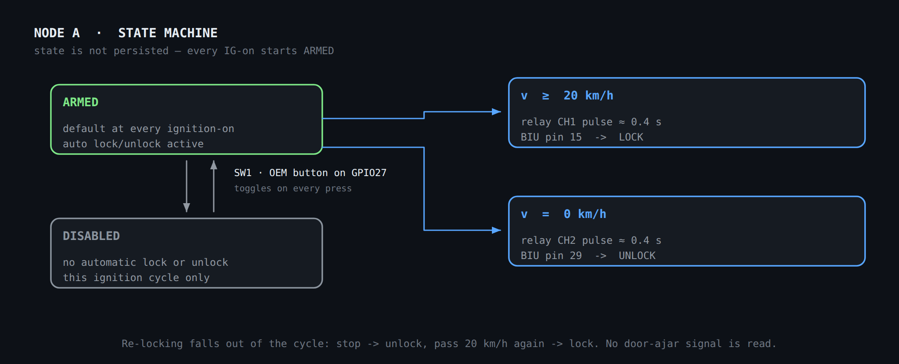

# Node A — Central locking

ESP32 next to the BIU (Body Integrated Unit), A-pillar. Receives vehicle speed
from Node B over ESP-NOW and drives the relays that pulse the BIU's lock and
unlock lines.

Deliberately simple: power + ignition sensing + relays + one button. Speed
arrives by radio, so there is no VSS hardware at all
([ADR 0002](../decisions/0002-speed-over-ssm2-not-vss.md)). The auto-lock ON/OFF
switch lives physically on **this** node
([ADR 0003](../decisions/0003-onoff-button-direct-to-node-a.md)).

## Stages and exact values

### Stage 1 · Power (IG to 5 V)

Identical to [Node B's power stage](node-b-gauge.md#stage-1--power-ig-to-5-v).

| Ref | Component | Value | Connection | Function |
| --- | --- | --- | --- | --- |
| F1 | Fuse | 2 A | series +12 V (IG) | protection |
| D1 | Schottky | SS34 | +12 V → VBAT | reverse polarity |
| D2 | TVS | SMAJ18A | VBAT → GND | transients |
| C1 | Electrolytic | 470 µF / 35 V | VBAT → GND | reserve |
| U1 | Switching regulator | Recom R-78E5.0-1.0 | VBAT → 5 V | fixed 12 V→5 V (7805 drop-in) |
| C3 | Electrolytic | 470 µF / 16 V | 5 V → GND | Wi-Fi spikes |

### Stage 2 · Ignition sensing

| Ref | Component | Value | Connection |
| --- | --- | --- | --- |
| R1 | Resistor | 10 kΩ | IG → node_IGN |
| R2 | Resistor | 3.3 kΩ | node_IGN → GND |
| D3 | Schottky clamp | BAT85 | node_IGN → 3.3 V |
| C5 | Ceramic | 100 nF | node_IGN → GND → GPIO34 |

### Stage 3 · Relays to the BIU

| Ref | Component | Control connection | Contacts |
| --- | --- | --- | --- |
| K1 | 2-channel relay module (5 V) | VCC→3.3 V · JD-VCC→5 V (jumper removed) · IN1→GPIO25 · IN2→GPIO26 | — |
| K1·CH1 | LOCK relay | GPIO25 | COM→BIU p15 · NO→GND |
| K1·CH2 | UNLOCK relay | GPIO26 | COM→BIU p29 · NO→GND |

> **Firing rule.** Each relay is energised for a **short pulse (≈0.4 s)**, never
> held. COM to the BIU wire, NO to ground: energising momentarily grounds the
> wire — a negative pulse — which locks or unlocks.

### Stage 4 · ON/OFF button (reused OEM switch)

A physical OEM switch already in the car, originally for the **windscreen-wiper
de-icer** — a North-American-market option this EDM car does not have — unused,
repurposed as the auto-lock toggle. Wired **directly to Node A**: it does not go
through Node B and does not travel over ESP-NOW. See
[ADR 0003](../decisions/0003-onoff-button-direct-to-node-a.md).

**Photo** — The switch panel to the left of the steering wheel. The button marked
in red is the unused wiper de-icer switch that becomes the auto-lock ON/OFF
control.

| Ref | Component | Value | Connection | Function |
| --- | --- | --- | --- | --- |
| SW1 | OEM switch (wiper de-icer, reused) | — | GPIO27 ↔ switch ↔ GND | toggles ARMED ⇄ DISABLED |

*No additional components: it uses the ESP32's internal pull-up on GPIO27
(`INPUT_PULLUP`), the same approach the source document specified for this
option.*

> ⚠️ **Open check on the vehicle.** OEM de-icer switches sometimes carry their own
> integrated indicator lamp, which changes how many pins the physical switch has.
> Confirm with a multimeter how many pins this button has and what each one does
> **before** wiring it to GPIO27. See
> [`docs/04-integration/`](../04-integration/README.md#open-checks-on-the-vehicle).

## ESP32 pin map (Node A)

| Function | GPIO | Note |
| --- | --- | --- |
| Ignition sensing | 34 | ADC · Stage 2 |
| LOCK relay (IN1) | 25 | → BIU p15 |
| UNLOCK relay (IN2) | 26 | → BIU p29 |
| ON/OFF button | 27 | `INPUT_PULLUP` · reused OEM switch, see Stage 4 |
| Speed (receive) | — (radio) | ESP-NOW ← Node B |
| Mode confirmation (transmit) | — (radio) | ESP-NOW → Node B, to show on the OLED |

## Behaviour, schematics and layout

### Functional behaviour

Node A receives speed from Node B over ESP-NOW and drives the relays that pulse
the BIU lines. The ON/OFF button on GPIO27 is local to this node. The logic is a
simple state machine:

- **Start-up:** on power-up (IG on) the system starts **ARMED** by default.
- **Lock:** while ARMED, on reaching **v ≥ 20 km/h**, emit a lock pulse on CH1 →
  BIU pin 15.
- **Unlock:** while ARMED, on coming to a stop (**v = 0 km/h**), emit an unlock
  pulse on CH2 → BIU pin 29.
- **Re-locking** falls out of the cycle: if the car stops (unlock) and passes
  20 km/h again, it locks again. No door-ajar signal is read.
- **Disabling:** the physical button (GPIO27) toggles between ARMED and
  **DISABLED** on each press. While DISABLED it neither locks nor unlocks
  automatically. Disabling is valid **for that ignition cycle only**: switch off
  and on again and it starts ARMED.
- **User confirmation:** whenever the button changes the mode, Node A sends the
  change to Node B over ESP-NOW, which displays it on the OLED (e.g.
  `AUTO-LOCK: ARMED` / `AUTO-LOCK: DISABLED`) for a couple of seconds before
  returning to the previous page. See [`docs/02-firmware/`](../02-firmware/README.md).
- **Threshold:** 20 km/h, parameterised in firmware.

**Fig. 6** — Node A state machine. State is not persisted; every ignition-on
starts ARMED.

### Interface schematic

**Fig. 7** — Node A interface. The relay module sits off the board with its screw
terminals. The ON/OFF button is wired straight to GPIO27 with the internal
pull-up; the ESP-NOW link carries speed inbound and the mode change outbound.

### Spatial layout

**Fig. 8** — Node A spatial layout. Speed arrives over ESP-NOW with no cable; the
ON/OFF switch is wired directly to the node (Stage 4). The relay module sits off
the board with its terminals facing the BIU. IG is taken at the A-pillar.

### Grid plan

**Fig. 9** — Node A grid plan. Far emptier than Node B: only the ESP32, the power
stage, one divider and the connectors — the relay module is external. The free
area is deliberate headroom for later I/O. Same 3 × 7 cm board as Node B — see
[perfboard size](README.md#perfboard-size-correction-to-the-source-document).

> **Pulse, not level.** Each relay is energised for a short pulse (≈0.4 s), never
> held. COM to the BIU wire, NO to ground: energising momentarily grounds the wire
> (a negative pulse), which locks or unlocks.
