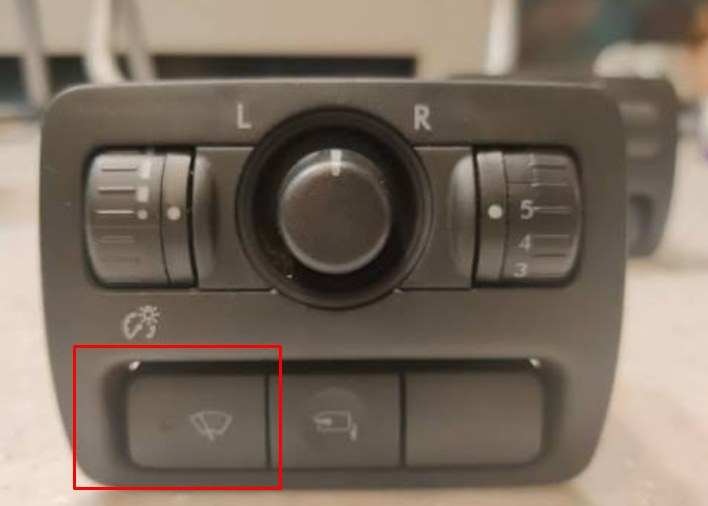
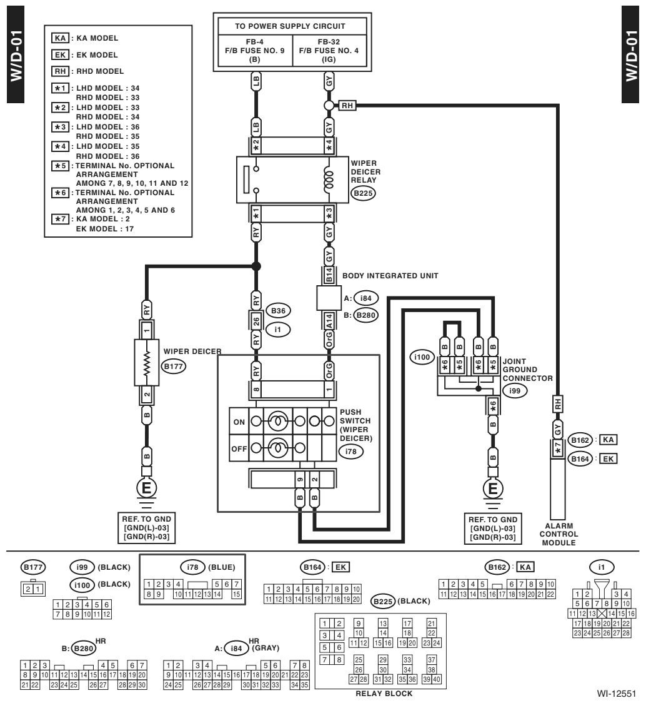
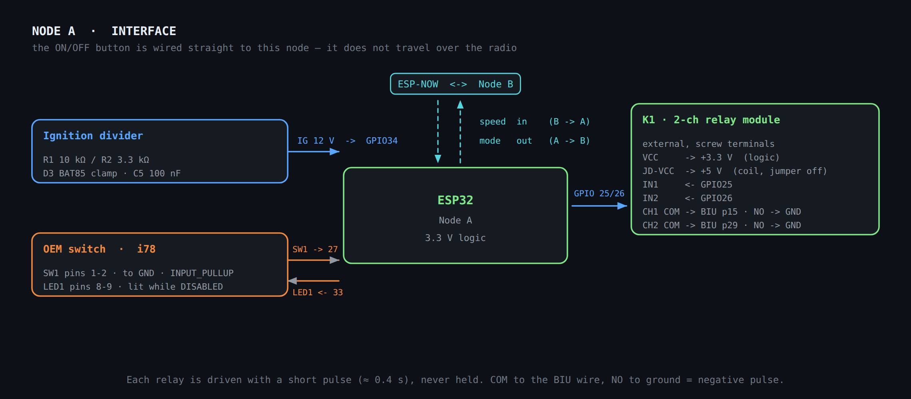
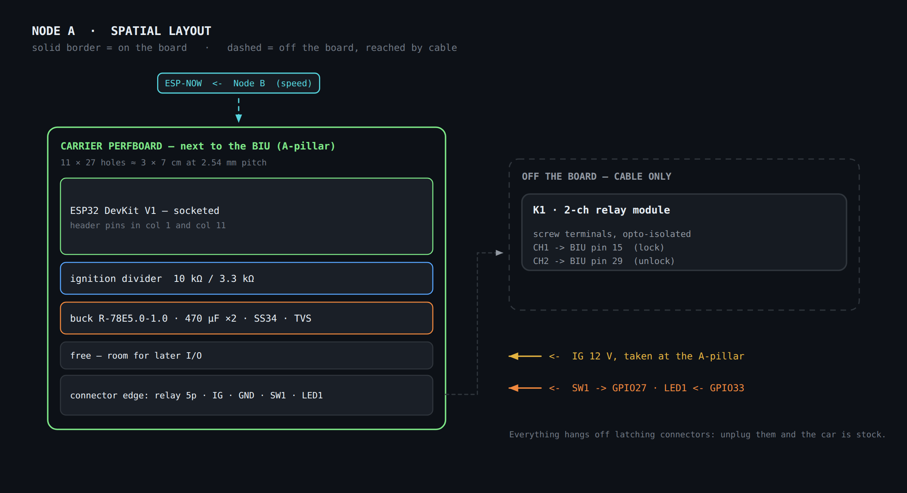
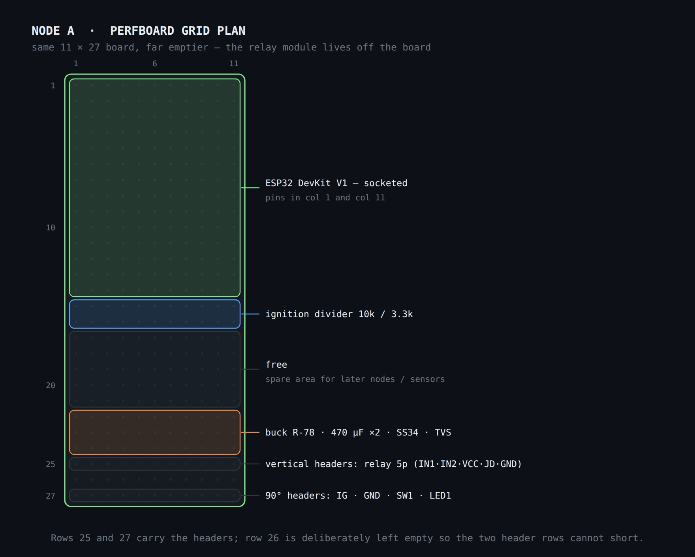

# Node A — Central locking

ESP32 next to the BIU (Body Integrated Unit), A-pillar. A **leaf of the ESP-NOW
star**: it receives speed from Node B, sends back the mode when the button is
pressed, and exchanges nothing with Node C.

Deliberately simple — power, ignition sensing, relays, one button, one LED. There
is no VSS hardware at all ([ADR 0002](../decisions/0002-speed-over-ssm2-not-vss.md)),
and the auto-lock ON/OFF switch is physically on **this** node
([ADR 0003](../decisions/0003-onoff-button-direct-to-node-a.md)).

**Behaviour is specified in [`docs/02-firmware/`](../02-firmware/README.md#node-a--locking).**
This page is the hardware only: stages, values, pin map and layout.

## Stages and exact values

### Stage 1 · Power (IG to 5 V)

Identical to [Node B's power stage](node-b-gauge.md#stage-1--power-ig-to-5-v).

| Ref | Component | Value | Connection | Function |
| --- | --- | --- | --- | --- |
| F1 | Fuse | 2 A | series +12 V (IG) | protection |
| D1 | Schottky | SS34 | +12 V → VBAT | reverse polarity |
| D2 | TVS | SMAJ18A | VBAT → GND | transients |
| C1 | Electrolytic | 470 µF / 35 V | VBAT → GND | reserve |
| U1 | Switching regulator | Recom R-78E5.0-1.0 | VBAT → 5 V | fixed 12 V→5 V (7805 drop-in) |
| C3 | Electrolytic | 470 µF / 16 V | 5 V → GND | Wi-Fi spikes |

### Stage 2 · Ignition sensing

| Ref | Component | Value | Connection |
| --- | --- | --- | --- |
| R1 | Resistor | 10 kΩ | IG → node_IGN |
| R2 | Resistor | 3.3 kΩ | node_IGN → GND |
| D3 | Schottky clamp | BAT85 | node_IGN → 3.3 V |
| C5 | Ceramic | 100 nF | node_IGN → GND · node_IGN feeds GPIO34 |

### Stage 3 · Relays to the BIU

| Ref | Component | Control connection | Contacts |
| --- | --- | --- | --- |
| K1 | 2-channel relay module (5 V) | VCC→3.3 V · JD-VCC→5 V (jumper removed) · IN1→GPIO25 · IN2→GPIO26 | — |
| K1·CH1 | LOCK relay | GPIO25 | COM→BIU p15 · NO→GND |
| K1·CH2 | UNLOCK relay | GPIO26 | COM→BIU p29 · NO→GND |

> **Pulse, not level.** COM goes to the BIU wire and NO to ground, so energising a
> relay momentarily grounds that wire — a negative pulse. It is never held; the
> [pulse duration](../02-firmware/README.md#v01-parameters) is a firmware parameter.

### Stage 4 · ON/OFF button (reused OEM switch)

An unused OEM switch — the **windscreen-wiper de-icer**, a North-American-market
option this EDM car does not have — wired **directly to Node A**. It does not go
through Node B and does not travel over ESP-NOW; why, and what was rejected, is in
[ADR 0003](../decisions/0003-onoff-button-direct-to-node-a.md).

**Photo** — The switch panel to the left of the steering wheel. The button marked
in red is the unused wiper de-icer switch that becomes the auto-lock ON/OFF
control.

#### The OEM circuit

**Figure** — Factory wiring diagram WD-01 / WI-12551. The push switch is the
block outlined in red; its connector, **i78 (blue)**, is outlined at the bottom.
See [reference material](reference/README.md) for provenance and licensing.

In the factory circuit the switch does *not* drive the de-icer relay directly.
Two fuses feed the circuit — F/B no. 9 (constant, LB) to the relay contacts and
F/B no. 4 (ignition, GY) to the relay coil — and the relay's contact output (RY)
feeds both the heating element and the switch. The coil's return path goes to the
**Body Integrated Unit**, which is what decides to energise it; that is why the
BIU sits in the middle rather than the switch simply closing the coil circuit.

The switch itself is **two devices in one body**, and that is the finding that
matters here:

| Pin | Wire | Goes to | What it is |
| --- | --- | --- | --- |
| **1** | OrG | BIU pin A14 | switch contact, high side |
| **2** | B | chassis ground | switch contact, low side |
| **8** | RY | relay contact output | indicator LED, high side |
| **9** | B | chassis ground | indicator LED, low side |

So the button is a **momentary contact between pins 1 and 2** (confirmed by
inspection on this car — unlike the folding-mirror switch in the same console, it
does not latch), plus an **indicator LED between pins 8 and 9** that in the
factory circuit lights only when the de-icer element is actually energised, not
when the button is pressed.

#### What the project takes from it

**Pins 1 and 2, and nothing else.** Pin 2 is already at chassis ground and pin 1
is a dry contact — exactly the topology this stage needs: `INPUT_PULLUP` on
GPIO27, other side to ground. No divider, no clamp, no conditioning.

**No new cable.** The OrG wire already runs console → BIU, and the BIU is where
Node A is installed — see the [cable schedule](assembly-and-wiring.md#cable-lengths).

> ⚠️ **Disconnect pin 1 from the BIU; do not tap it in parallel.** Sharing the node
> between the BIU's input and the ESP32's pull-up would signal every press to both.
> Even with no de-icer to operate, "probably harmless" is not a standard to apply
> to a body control module. Disconnecting at the switch connector also keeps the
> modification reversible.

#### The tell-tale LED

With no de-icer relay fitted, pin 8 receives nothing and the OEM indicator never
lights. Driven from Node A instead it becomes a status light **inside the OEM
button** — the most retromod outcome available.

It signals **DISABLED, not ARMED** — the reasoning is in
[ADR 0003](../decisions/0003-onoff-button-direct-to-node-a.md#amendments).

| Ref | Component | Value | Connection | Function |
| --- | --- | --- | --- | --- |
| SW1 | OEM switch contact (i78 pins 1–2) | — | GPIO27 ↔ switch ↔ GND | momentary; toggles ARMED ⇄ DISABLED |
| LED1 | OEM indicator LED (i78 pins 8–9) | — | GPIO33 → pin 8 · pin 9 to GND | lit while DISABLED |

*No additional components on the switch contact: it uses the ESP32's internal
pull-up on GPIO27 (`INPUT_PULLUP`), the same approach the source document
specified for this option.*

How it is driven is **`OC-07`**, still open. The factory diagram shows no discrete
series resistor in the 8–9 path, so the limiting resistor is almost certainly
inside the switch body and sized for 12 V. If so, a 3.3 V GPIO yields roughly
2 mA — dim, but visible in a dark cabin, and needing **no components at all**. The
fallbacks are a low-side MOSFET fed from Node A's protected 12 V rail, or
replacing the twenty-year-old LED outright. Measure before designing either:
[`OC-07`](../04-integration/README.md#open-checks-on-the-vehicle).

## ESP32 pin map (Node A)

| Function | GPIO | Note |
| --- | --- | --- |
| Ignition sensing | 34 | ADC · Stage 2 |
| LOCK relay (IN1) | 25 | → BIU p15 |
| UNLOCK relay (IN2) | 26 | → BIU p29 |
| ON/OFF button | 27 | `INPUT_PULLUP` · reused OEM switch contact (i78 pins 1–2), see Stage 4 |
| Status tell-tale | 33 | output · OEM indicator LED (i78 pins 8–9), lit while DISABLED |
| Speed (receive) | — (radio) | ESP-NOW ← Node B |
| Mode confirmation (transmit) | — (radio) | ESP-NOW → Node B, to show on the OLED |

## Schematics and layout

The state machine, the thresholds and the pulse timing are in
[`docs/02-firmware/`](../02-firmware/README.md#node-a--locking), with Fig. 6.

### Interface schematic

**Fig. 7** — Node A interface. The relay module sits off the board with its screw
terminals. The ON/OFF button is wired straight to GPIO27 with the internal
pull-up; the ESP-NOW link carries speed inbound and the mode change outbound.

### Spatial layout

**Fig. 8** — Node A spatial layout. Speed arrives over ESP-NOW with no cable; the
ON/OFF switch is wired directly to the node (Stage 4). The relay module sits off
the board with its terminals facing the BIU. IG is taken at the A-pillar.

### Grid plan

**Fig. 9** — Node A grid plan. Far emptier than Node B: only the ESP32, the power
stage, one divider and the connectors — the relay module is external. The free
area is deliberate headroom for later I/O. Same 3 × 7 cm board as Node B — see
[perfboard size](README.md#perfboard-size-correction-to-the-source-document).
