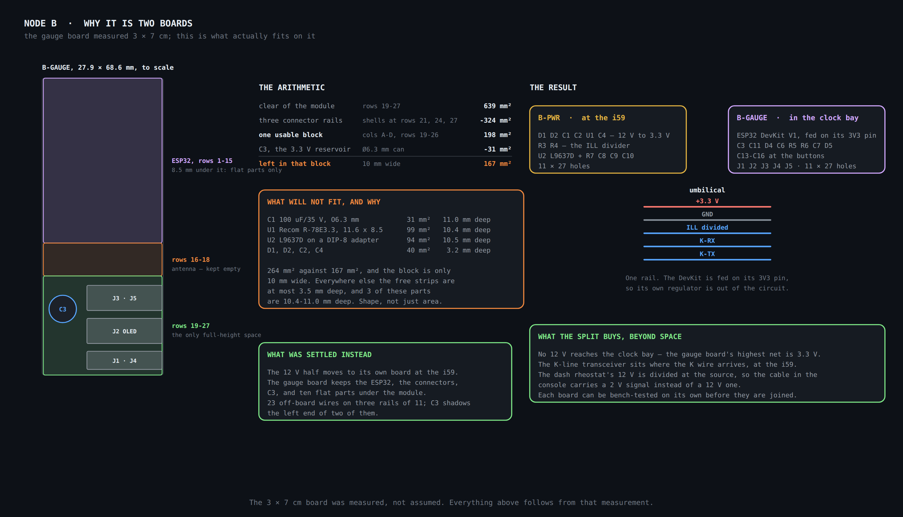
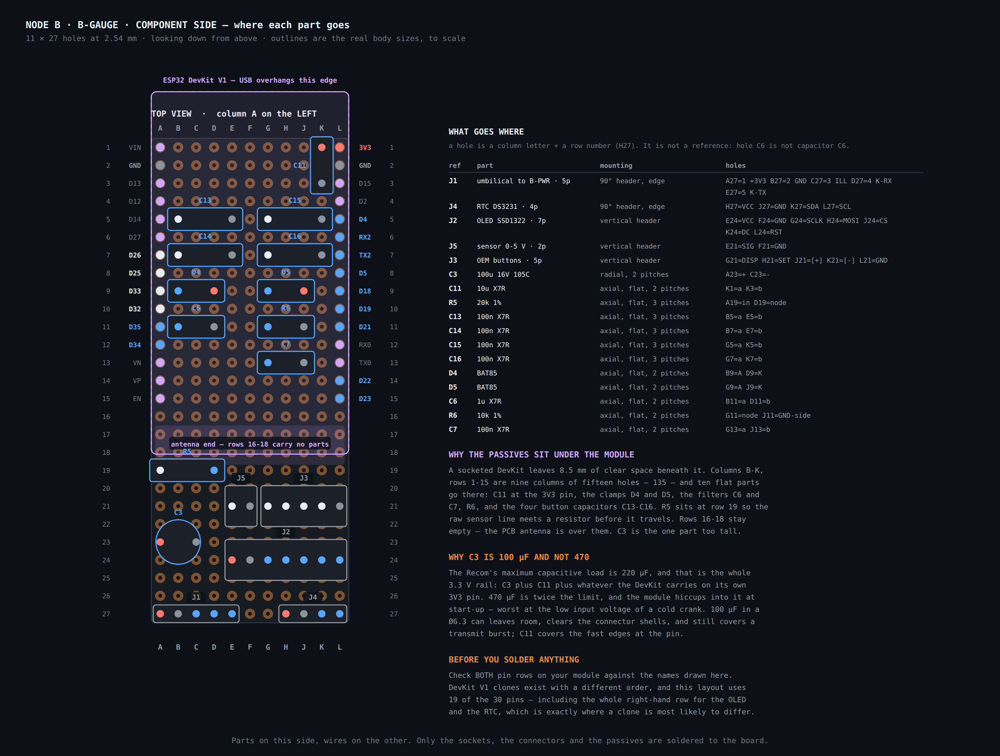
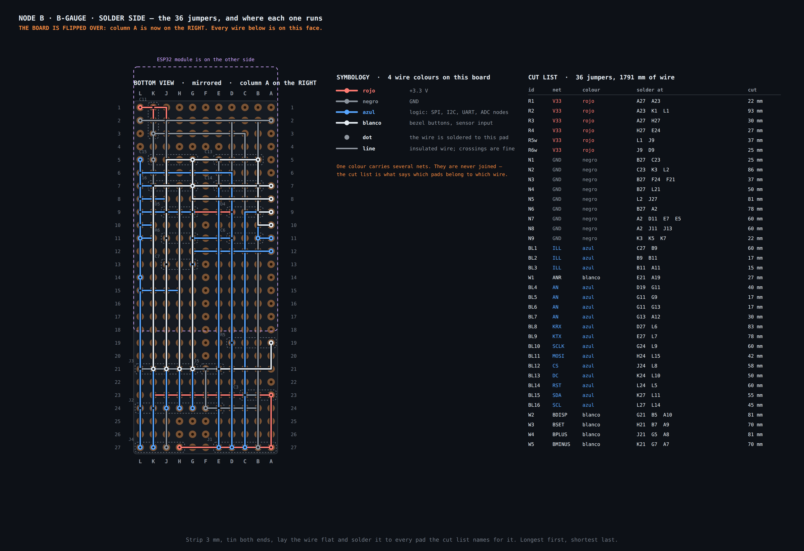
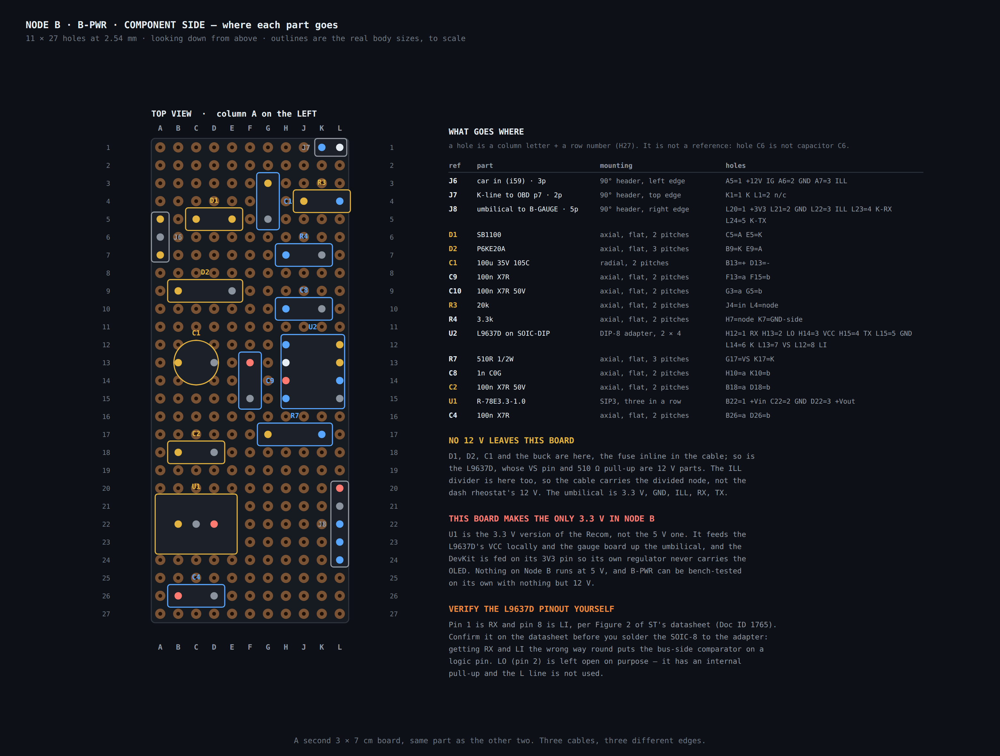
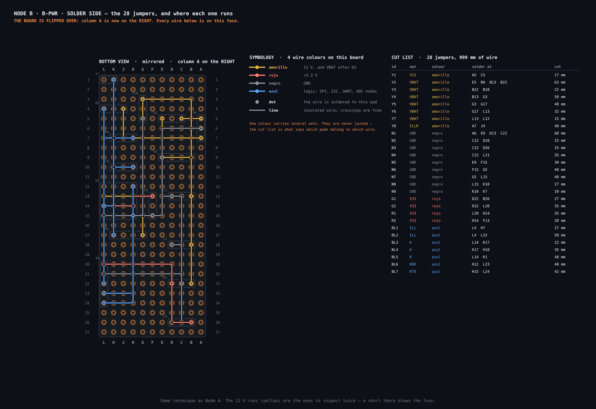
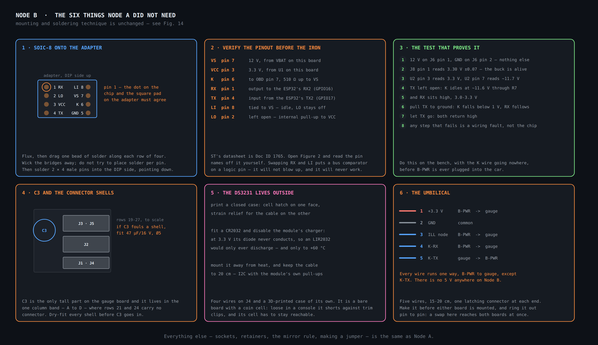

# Node B — building the two boards

Hole-by-hole assembly for Node B: where every part goes, every jumper on the
solder side, and the order to do it in. Component values are in
[`node-b-gauge.md`](node-b-gauge.md); this page is the physical build.

Written for someone comfortable with electronics who has not wired a perfboard at
this density before. It assumes [Node A's build page](node-a-build.md) has been
read — mounting technique, the mirror rule and how to make a jumper are there and
are not repeated.

> **Three things changed in v0.1.8 after this page was first written**, and an
> older printout is not safe to build from: the right-hand header column was
> indexed from the wrong end of the module, Node B now runs on **one 3.3 V rail**
> rather than 5 V, and the umbilical is **five wires**, not six.

## Node B is two boards

**Fig. 15** — The space budget that forced the split, and what the split buys.

The gauge board is **3 × 7 cm, measured**. With the DevKit socketed, the only
full-height space on it is rows 19–27. After three rails of connectors the one
usable block is about 10 mm wide, against three parts that are 8.5–10.5 mm deep.
It is a shape problem, not an area one, and no rearrangement solves it.

So Node B is built as:

| Board | Where | Carries |
| --- | --- | --- |
| **B-PWR** | at the i59 adapter | everything that touches 12 V: D1, D2, C1, C2, U1, C4, the ILL divider R3/R4, and the L9637D with R7, C8, C9, C10 |
| **B-GAUGE** | in the OEM clock bay | the ESP32, the five connectors, C3, C11, and the ten flat parts under the module |

They are joined by a **five-wire umbilical**, 15–20 cm. **Nothing on Node B runs
at 5 V**: U1 is the 3.3 V Recom, and the DevKit is fed on its `3V3` pin.

## The boards and how holes are named

**Two 3 × 7 cm double-sided perfboards, 11 × 27 holes at 2.54 mm each** — the same
part as Node A's, bought three times.

Columns are lettered **A B C D E F G H J K L** — the letter I is skipped so it
cannot be read as a 1. Rows are numbered **1 to 27**.

> **A hole is not a reference designator.** Hole `C6` is column C, row 6.
> Capacitor `C6` is the 1 µF on the ILL node, and it lives in holes `B11` and
> `D11`. The tables always give holes in the *holes* column.

On **B-GAUGE**, row 1 is the USB end and **`3V3` sits beside `VIN` at that end** —
see [which way round the module is](node-a-build.md#which-way-round-the-module-is),
which is where this repository got it wrong for seven releases. The module owns
rows 1–15; its body and PCB antenna reach to row 18, so rows 16–18 carry no parts;
and the nine columns between the headers keep **8.5 mm of clearance** underneath,
which is where ten flat parts and all the wiring go.

On **B-PWR** there is no module, so both long edges are free. Its three cables
leave on three different edges — the car on the left, the OBD K-line at the top,
the umbilical on the right.

## Wire colours

Five colours on these boards; the sixth, verde, is not used because Node B has no
5 V rail.

| Wire | Carries |
| --- | --- |
| **Amarillo** | 12 V — the raw IG feed, VBAT after D1, and the raw ILL line |
| **Negro** | GND |
| **Rojo** | +3.3 V, the only supply rail in the node |
| **Azul** | logic — SPI, I²C, the K-line UART, the K bus itself, and the two divided ADC nodes |
| **Blanco** | the bezel buttons, and the sensor input on J5 |

> **Every colour here carries more than one net.** Azul alone carries twelve. The
> cut list is what says which pads belong to which wire; the colour only tells you
> which reel to cut from.

## Read this before the iron is hot

1. **Verify the L9637D's pinout on ST's datasheet, Doc ID 1765, Figure 2.** These
   drawings use pin 1 = RX, 2 = LO, 3 = VCC, 4 = TX, 5 = GND, 6 = K, 7 = VS,
   8 = LI. Read it off the datasheet yourself before the SOIC-8 goes onto the
   adapter.
2. **Check both pin rows of your DevKit against Fig. 16.** This layout uses 19 of
   the 30 pins, including the whole right-hand row.
3. **The axial substitutes are SB1100 and P6KE20A**, on 2- and 3-pitch footprints
   respectively. The parts this repository used to name could not physically be
   fitted — see [Node A, point 2](node-a-build.md#read-this-before-the-iron-is-hot).
4. **Resistor sizes are not interchangeable.** R3–R6 are **⅛ W** (a ¼ W body is
   6.3 mm and will not fit a 2-pitch span); **R5 and R6 are 1 % metal film**
   because they set an ADC scale, and 5 % carbon film would cost ±6.8 % of full
   scale before the sensor's own error; **R7 is ½ W metal oxide** on a 3-pitch
   footprint, because it drops 0.26 W whenever the K bus is held dominant.
5. **Specify every dielectric.** C6, C7, C9, C11, C13–C16, C2, C4, C10 are
   **X7R**; C8 is **C0G/NP0** because its value is a specification, not a target.
   A Y5V part of the same marking loses up to 82 % of its capacitance by −30 °C:
   C6 would stop filtering the ILL node exactly when the car is cold. C2, C8 and
   C10 are **50 V** parts — they sit on nets D2 can clamp to 27.7 V.
6. **C1 and C3 are 100 µF, 105 °C.** 470 µF exceeds the Recom's 220 µF maximum
   capacitive load, and an 85 °C electrolytic is a five-year part at a 70 °C
   console ambient.
7. **The fuse is 1 A slow-blow**, inline in the +12 V cable before J6.
8. **Never have USB and the umbilical plugged in at the same time.** The DevKit is
   fed on its `3V3` pin; plugging USB powers the module's own regulator against
   it.

## B-GAUGE

### Component side

**Fig. 16** — Every part, in the hole it goes in, with its real body outline drawn
to scale.

| ref | part | mounting | holes |
| --- | --- | --- | --- |
| J1 | umbilical to B-PWR · 5p | 90° header, edge | `A27`=1 +3V3 `B27`=2 GND `C27`=3 ILL `D27`=4 K-RX `E27`=5 K-TX |
| J4 | RTC DS3231 · 4p | 90° header, edge | `H27`=VCC `J27`=GND `K27`=SDA `L27`=SCL |
| J2 | OLED SSD1322 · 7p | vertical header | `E24`=VCC `F24`=GND `G24`=SCLK `H24`=MOSI `J24`=CS `K24`=DC `L24`=RST |
| J5 | sensor 0-5 V · 2p | vertical header | `E21`=SIG `F21`=GND |
| J3 | OEM buttons · 5p | vertical header | `G21`=DISP `H21`=SET `J21`=[+] `K21`=[-] `L21`=GND |
| C3 | 100u 16V 105C | radial, 2 pitches | `A23`=+ `C23`=- |
| C11 | 10u X7R | axial, flat, 2 pitches | `K1`=a `K3`=b |
| R5 | 20k 1% | axial, flat, 3 pitches | `A19`=in `D19`=node |
| C13 | 100n X7R | axial, flat, 3 pitches | `B5`=a `E5`=b |
| C14 | 100n X7R | axial, flat, 3 pitches | `B7`=a `E7`=b |
| C15 | 100n X7R | axial, flat, 3 pitches | `G5`=a `K5`=b |
| C16 | 100n X7R | axial, flat, 3 pitches | `G7`=a `K7`=b |
| D4 | BAT85 | axial, flat, 2 pitches | `B9`=A `D9`=K |
| D5 | BAT85 | axial, flat, 2 pitches | `G9`=A `J9`=K |
| C6 | 1u X7R | axial, flat, 2 pitches | `B11`=a `D11`=b |
| R6 | 10k 1% | axial, flat, 2 pitches | `G11`=node `J11`=GND-side |
| C7 | 100n X7R | axial, flat, 2 pitches | `G13`=a `J13`=b |

### Solder side

**Fig. 17** — B-GAUGE's **36 jumpers, 1791 mm of wire**, mirrored: **column A is
on the right**.

| id | net | colour | solder at | cut | what it does |
| --- | --- | --- | --- | --- | --- |
| `R1` | V33 | rojo | `A27` `A23` | 22 mm | J1 +3V3 -> C3 + |
| `R2` | V33 | rojo | `A23` `K1` `L1` | 93 mm | -> C11 -> ESP32 3V3 pin |
| `R3` | V33 | rojo | `A27` `H27` | 30 mm | -> RTC VCC |
| `R4` | V33 | rojo | `H27` `E24` | 27 mm | -> OLED VCC |
| `R5w` | V33 | rojo | `L1` `J9` | 37 mm | -> D5 cathode |
| `R6w` | V33 | rojo | `J9` `D9` | 25 mm | -> D4 cathode |
| `N1` | GND | negro | `B27` `C23` | 25 mm | J1 GND -> C3 - |
| `N2` | GND | negro | `C23` `K3` `L2` | 86 mm | -> C11 -> ESP32 GND |
| `N3` | GND | negro | `B27` `F24` `F21` | 37 mm | -> OLED, sensor |
| `N4` | GND | negro | `B27` `L21` | 50 mm | -> buttons common |
| `N5` | GND | negro | `L2` `J27` | 81 mm | -> RTC GND |
| `N6` | GND | negro | `B27` `A2` | 78 mm | -> ESP32 GND, left row |
| `N7` | GND | negro | `A2` `D11` `E7` `E5` | 60 mm | -> C6, C14, C13 |
| `N8` | GND | negro | `A2` `J11` `J13` | 60 mm | -> R6, C7 |
| `N9` | GND | negro | `K3` `K5` `K7` | 22 mm | -> C15, C16 |
| `BL1` | ILL | azul | `C27` `B9` | 60 mm | umbilical ILL -> D4 anode |
| `BL2` | ILL | azul | `B9` `B11` | 17 mm | -> C6 |
| `BL3` | ILL | azul | `B11` `A11` | 15 mm | -> GPIO35 |
| `W1` | ANR | blanco | `E21` `A19` | 27 mm | J5 -> R5 |
| `BL4` | AN | azul | `D19` `G11` | 40 mm | R5 -> R6 |
| `BL5` | AN | azul | `G11` `G9` | 17 mm | -> D5 anode |
| `BL6` | AN | azul | `G11` `G13` | 17 mm | -> C7 |
| `BL7` | AN | azul | `G13` `A12` | 30 mm | -> GPIO34 |
| `BL8` | KRX | azul | `D27` `L6` | 83 mm | umbilical -> RX2 |
| `BL9` | KTX | azul | `E27` `L7` | 78 mm | umbilical -> TX2 |
| `BL10` | SCLK | azul | `G24` `L9` | 60 mm | OLED -> GPIO18 |
| `BL11` | MOSI | azul | `H24` `L15` | 42 mm | OLED -> GPIO23 |
| `BL12` | CS | azul | `J24` `L8` | 58 mm | OLED -> GPIO5 |
| `BL13` | DC | azul | `K24` `L10` | 50 mm | OLED -> GPIO19 |
| `BL14` | RST | azul | `L24` `L5` | 60 mm | OLED -> GPIO4 |
| `BL15` | SDA | azul | `K27` `L11` | 55 mm | RTC -> GPIO21 |
| `BL16` | SCL | azul | `L27` `L14` | 45 mm | RTC -> GPIO22 |
| `W2` | BDISP | blanco | `G21` `B5` `A10` | 81 mm | DISP -> C13 -> GPIO32 |
| `W3` | BSET | blanco | `H21` `B7` `A9` | 70 mm | SET -> C14 -> GPIO33 |
| `W4` | BPLUS | blanco | `J21` `G5` `A8` | 81 mm | [+] -> C15 -> GPIO25 |
| `W5` | BMINUS | blanco | `K21` `G7` `A7` | 70 mm | [-] -> C16 -> GPIO26 |

## B-PWR

### Component side

**Fig. 18** — B-PWR. The 12 V chain runs down columns A–E, the K-line block sits
in columns F–L, and the three cables leave on three different edges.

| ref | part | mounting | holes |
| --- | --- | --- | --- |
| J6 | car in (i59) · 3p | 90° header, left edge | `A5`=1 +12V IG `A6`=2 GND `A7`=3 ILL |
| J7 | K-line to OBD p7 · 2p | 90° header, top edge | `K1`=1 K `L1`=2 n/c |
| J8 | umbilical to B-GAUGE · 5p | 90° header, right edge | `L20`=1 +3V3 `L21`=2 GND `L22`=3 ILL `L23`=4 K-RX `L24`=5 K-TX |
| D1 | SB1100 | axial, flat, 2 pitches | `C5`=A `E5`=K |
| D2 | P6KE20A | axial, flat, 3 pitches | `B9`=K `E9`=A |
| C1 | 100u 35V 105C | radial, 2 pitches | `B13`=+ `D13`=- |
| C9 | 100n X7R | axial, flat, 2 pitches | `F13`=a `F15`=b |
| C10 | 100n X7R 50V | axial, flat, 2 pitches | `G3`=a `G5`=b |
| R3 | 20k | axial, flat, 2 pitches | `J4`=in `L4`=node |
| R4 | 3.3k | axial, flat, 2 pitches | `H7`=node `K7`=GND-side |
| U2 | L9637D on SOIC-DIP | DIP-8 adapter, 2 × 4 | `H12`=1 RX `H13`=2 LO `H14`=3 VCC `H15`=4 TX `L15`=5 GND `L14`=6 K `L13`=7 VS `L12`=8 LI |
| R7 | 510R 1/2W | axial, flat, 3 pitches | `G17`=VS `K17`=K |
| C8 | 1n C0G | axial, flat, 2 pitches | `H10`=a `K10`=b |
| C2 | 100n X7R 50V | axial, flat, 2 pitches | `B18`=a `D18`=b |
| U1 | R-78E3.3-1.0 | SIP3, three in a row | `B22`=1 +Vin `C22`=2 GND `D22`=3 +Vout |
| C4 | 100n X7R | axial, flat, 2 pitches | `B26`=a `D26`=b |

### Solder side

**Fig. 19** — B-PWR's **28 jumpers, 999 mm of wire**, mirrored. The amarillo runs
are the ones to inspect twice: a short there blows the fuse.

| id | net | colour | solder at | cut | what it does |
| --- | --- | --- | --- | --- | --- |
| `Y1` | V12 | amarillo | `A5` `C5` | 17 mm | J6 +12 V -> D1 anode |
| `Y2` | VBAT | amarillo | `E5` `B9` `B13` `B22` | 63 mm | D1 K -> D2 -> C1+ -> U1 +Vin |
| `Y3` | VBAT | amarillo | `B22` `B18` | 22 mm | -> C2 |
| `Y4` | VBAT | amarillo | `B13` `G3` | 50 mm | -> C10 |
| `Y5` | VBAT | amarillo | `G3` `G17` | 48 mm | -> R7 |
| `Y6` | VBAT | amarillo | `G17` `L13` | 32 mm | -> U2 VS |
| `Y7` | VBAT | amarillo | `L13` `L12` | 15 mm | VS -> LI (see the note on LI) |
| `Y8` | ILLR | amarillo | `A7` `J4` | 40 mm | J6 ILL -> R3 |
| `N1` | GND | negro | `A6` `E9` `D13` `C22` | 68 mm | J6 GND -> D2 -> C1- -> U1 GND |
| `N2` | GND | negro | `C22` `D18` | 25 mm | -> C2 |
| `N3` | GND | negro | `C22` `D26` | 25 mm | -> C4 |
| `N4` | GND | negro | `C22` `L21` | 35 mm | -> umbilical GND |
| `N5` | GND | negro | `E9` `F15` | 30 mm | -> C9 |
| `N6` | GND | negro | `F15` `G5` | 40 mm | -> C10 |
| `N7` | GND | negro | `G5` `L15` | 48 mm | -> U2 GND |
| `N8` | GND | negro | `L15` `K10` | 27 mm | -> C8 |
| `N9` | GND | negro | `K10` `K7` | 20 mm | -> R4 lower leg |
| `G1` | V33 | rojo | `D22` `B26` | 27 mm | U1 out -> C4 |
| `G2` | V33 | rojo | `D22` `L20` | 35 mm | -> umbilical |
| `R1` | V33 | rojo | `L20` `H14` | 35 mm | -> U2 VCC |
| `R2` | V33 | rojo | `H14` `F13` | 20 mm | -> C9 |
| `BL1` | ILL | azul | `L4` `H7` | 27 mm | R3 out -> R4 in |
| `BL2` | ILL | azul | `L4` `L22` | 58 mm | -> umbilical |
| `BL3` | K | azul | `L14` `K17` | 22 mm | U2 K -> R7 pull-up |
| `BL4` | K | azul | `K17` `H10` | 35 mm | -> C8 |
| `BL5` | K | azul | `L14` `K1` | 48 mm | -> J7, to OBD pin 7 |
| `BL6` | KRX | azul | `H12` `L23` | 48 mm | U2 RX -> umbilical |
| `BL7` | KTX | azul | `H15` `L24` | 42 mm | U2 TX <- umbilical |

## What Node B needs that Node A did not

**Fig. 20** — The SOIC-8 adapter, verifying the pinout, the bench test that proves
the transceiver, C3's clearance, the DS3231's case, and the umbilical.

## Order of work

Each stage ends in a measurement. **If the measurement is wrong, stop and fix it
before the next stage** — every later stage assumes the earlier ones are good. Run
ids repeat across the two boards, so each list says which board it belongs to.

### 1 · The umbilical, first

Five wires, 15–20 cm, one latching connector at each end, made before either board
is mounted. Ring it out pin to pin: a swap here reaches both boards at once, and
the two ends are identical 5-pin housings, so nothing else catches it.

| Pin | Net | Direction |
| --- | --- | --- |
| 1 | +3.3 V | B-PWR → gauge |
| 2 | GND | common |
| 3 | ILL, divided | B-PWR → gauge |
| 4 | K-RX | B-PWR → gauge |
| 5 | K-TX | gauge → B-PWR |

### 2 · B-PWR: the supply

Fit J6, J8, D1, D2, C1, C2, U1, C4 and B-PWR runs
`Y1 Y2 Y3 N1 N2 N3 N4 G1 G2`.

**Measure:** 12 V on J6 pin 1 through the 1 A fuse → J8 pin 1 reads **3.30 V
±0.07 V** (the Recom is a ±2 % part). VBAT at C1's + lead reads **11.7–11.9 V** —
the Schottky drops only ~0.2 V at the few milliamps an unloaded buck takes. Power
off: J6 pin 1 to J8 pin 2 must read open, not short.

### 3 · B-PWR: the K-line transceiver

Solder the SOIC-8 to its adapter (Fig. 20, panel 1), fit a **machined-pin 8-way
DIP socket** in holes `H12`–`H15` and `L12`–`L15`, plug the adapter into it, then
fit C9, C10, R7, C8 and J7. Add B-PWR runs
`Y4 Y5 Y6 Y7 N5 N6 N7 N8 R1 R2 BL3 BL4 BL5 BL6 BL7`.

`Y7` is a single jumper from `L13` to `L12`, tying **LI to VS**. `H13` (LO) is
left unconnected on purpose.

> Use a **turned-pin, gold-plated** socket rather than the usual dual-wipe leaf
> type. This stacks three separable interfaces — chip to adapter, adapter to
> socket, socket to board — on the one part whose intermittent contact would jam
> the car's diagnostic K-line for every tool, not just this one.

**Measure:** with 12 V on J6 pin 1 and **nothing else connected** — the 3.3 V now
comes from U1 on this same board — run the test in Fig. 20, panel 3. K idles a few
tenths under VBAT, RX sits at 3.0–3.3 V, and pulling TX to ground drops K below
1 V with RX following.

### 4 · B-PWR: the ILL divider

Fit R3, R4 and B-PWR runs `Y8 BL1 BL2 N9`.

**Measure:** 12 V on J6 pin 3 → J8 pin 3 reads **1.70 V**. At a 14.4 V charging
voltage it reads 2.04 V, and at 16 V it reads 2.27 V — all inside ADC1's usable
range and all below the 3.3 V rail.

### 5 · B-GAUGE: sockets and connectors

Two 15-way female headers in column A and column L; J1 and J4 as 90° headers on
row 27; J2, J3 and J5 as vertical headers on rows 24 and 21.

Tack **one** pin of each 15-way header, plug the module in, check it sits flat and
square, then solder the rest. **Dry-fit J2, J3 and J5's mating shells now**, before
C3 goes in.

Do not fit the ESP32 yet.

### 6 · B-GAUGE: power in, no module fitted

Fit C3 and C11, and B-GAUGE runs `R1 R2 N1 N2`.

**Measure:** 3.3 V on J1 pin 1, meter across the socket holes `L1` and `L2` →
**3.3 V**, right polarity. Power off: `L1` to `L2` must read open, not short. Only
then plug the module in.

> `A1` — the module's `VIN` pin — stays unconnected. Nothing on this board feeds
> it, and nothing should.

### 7 · B-GAUGE: the module, and the two boards joined

Plug the ESP32 in. Fit B-GAUGE runs `N3 N4 N5 N6 R3 R4 R5w R6w BL8 BL9`.

**Measure:** 3.3 V at J4 pin 1 and J2 pin 1. Now join the two boards with the
umbilical and repeat stage 3's transceiver test end to end: it must behave
identically, because nothing about U2's supply has changed.

### 8 · B-GAUGE: the two ADC chains

Fit D4, C6 (ILL) and R5, R6, C7, D5 (sensor), with B-GAUGE runs
`BL1 BL2 BL3 W1 BL4 BL5 BL6 BL7 N7 N8`.

**Measure with the node powered and the umbilical connected** — D4 and D5 clamp
to the 3.3 V rail, so on an unpowered board they conduct into a dead rail and both
readings come out low and mean nothing. With 12 V on B-PWR's J6 pin 1 *and* pin 3,
socket hole `A11` (GPIO35) reads **1.70 V**. Feed 5.0 V into J5 pin 1 and hole
`A12` (GPIO34) reads **1.67 V**. **No ESP32 input may exceed 3.3 V** — if either
does, the divider is wrong, not the clamp.

### 9 · B-GAUGE: display, clock and buttons

Fit C13–C16 and B-GAUGE runs
`BL10 BL11 BL12 BL13 BL14 BL15 BL16 W2 W3 W4 W5 N9`.

**Measure:** continuity from each connector pin to the GPIO socket hole it belongs
to, against Fig. 16's hole list. Then, once there is firmware, put a meter in
series with the OLED's 3.3 V lead and **write its current down**: 310 mA is the
figure for the reference module, and the whole supply architecture is sized from
it.

### 10 · First flash

Nothing above needs firmware; everything from here does. **Unplug the umbilical**,
connect USB to the DevKit's row-1 edge, flash, then disconnect USB before the
umbilical goes back on.

The toolchain and the flashing procedure are an
[open firmware item](../02-firmware/README.md#open-items); `/firmware` is empty, so
until it is written, stage 9's display measurement is the one step on this page
that cannot be completed.

### 11 · Inspection

Under a magnifier, with each board tilted to the light:

- Every joint shiny and concave, none domed or dull.
- Tug every jumper. A joint that moves is cold — reheat it, do not add solder.
- No stray solder bridging adjacent pads, especially along B-GAUGE's row 27 and
  across U2's socket.
- Every wire flat against the board.
- On B-GAUGE, nothing at all in rows 16–18.

Then run the [multimeter checklist](../04-integration/README.md#multimeter-checklist)
before either board goes near the car.

## What leaves the boards

**B-PWR** — three connectors, three edges.

| Connector | To | Wires |
| --- | --- | --- |
| J6 | the i59 adapter | +12 V IG (fused, **1 A slow-blow**), GND, ILL |
| J7 | OBD pin 7 | K. Pin 2 is a spare and is not connected |
| J8 | B-GAUGE | the five umbilical wires |

**B-GAUGE** — five connectors.

| Connector | To | Wires |
| --- | --- | --- |
| J1 | B-PWR | the five umbilical wires |
| J2 | the OLED, in the bezel | VCC, GND, SCLK, MOSI, CS, DC, RST |
| J3 | the OEM buttons, in the bezel | DISP, SET, [+], [−], GND |
| J4 | the DS3231, in its own printed case | VCC, GND, SDA, SCL |
| J5 | a 0–5 V sensor, if one is ever fitted | SIG, GND |

## Open on these boards

- **The L9637D's pinout** — verified against ST's datasheet before soldering, per
  step 1 above. Record which revision you read.
- **LI tied to VS.** The datasheet specifies what happens when LI is left open
  (LO is driven on) but gives no guidance for a K-line-only design. VS is the idle
  state and draws a few microamps. `Y7` is one jumper, so this is trivially
  reversible.
- **The OLED module's actual 3.3 V current.** 310 mA typical / 340 mA maximum is
  Newhaven's figure for the reference design. It is the single number the supply
  is sized from, and it has not been measured on the module that will be fitted.
- **`OC-05`** (display colour) and **`OC-08`** (the contact-pad layout on the car's
  own unit) are both still open and both affect the bezel, not these boards.
- **`OC-12`** — whether the ILL feed is live with the key out.
- **The Recom's input filter.** Its datasheet calls for a 10 µF MLCC at the input
  and an LC filter for EN55032 compliance; B-PWR has C2 and no choke. A 330 kHz
  switcher on a harness that shares a fuse box with the audio system is the kind of
  thing that shows up as interference and not as a failure. Add the 10 µF if you
  are ordering parts anyway.
- **Spare capacity.** B-GAUGE's three rails hold 33 positions and 23 are used;
  under the module, columns B–K rows 1–15 keep 115 of their 135 holes. B-PWR uses
  43 of its 297.
