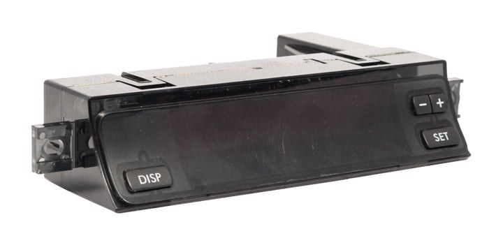
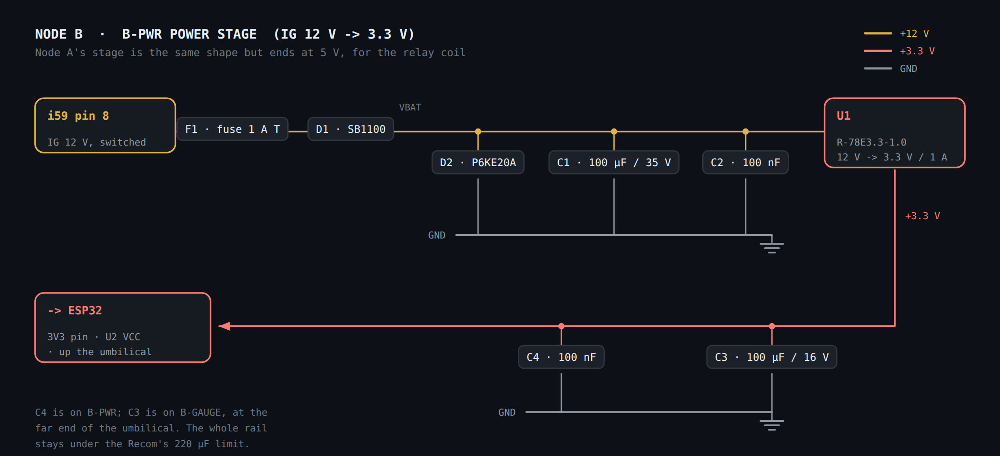
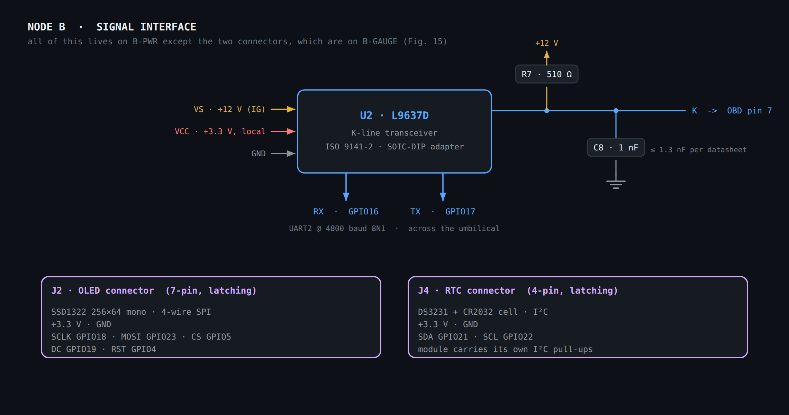
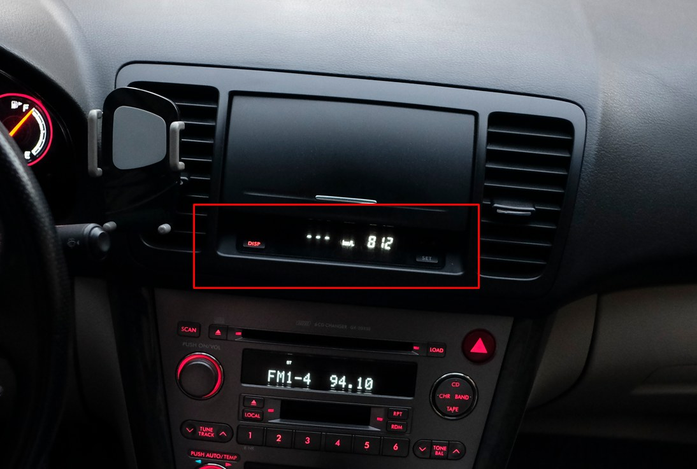
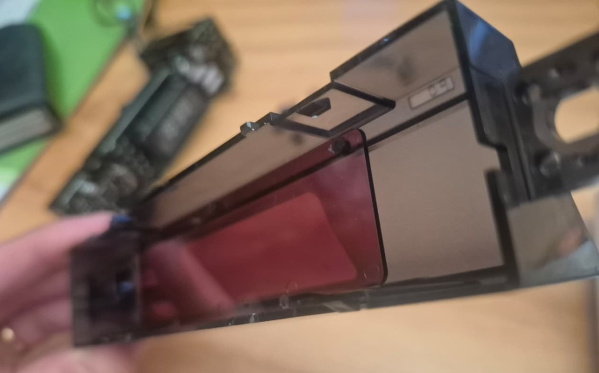
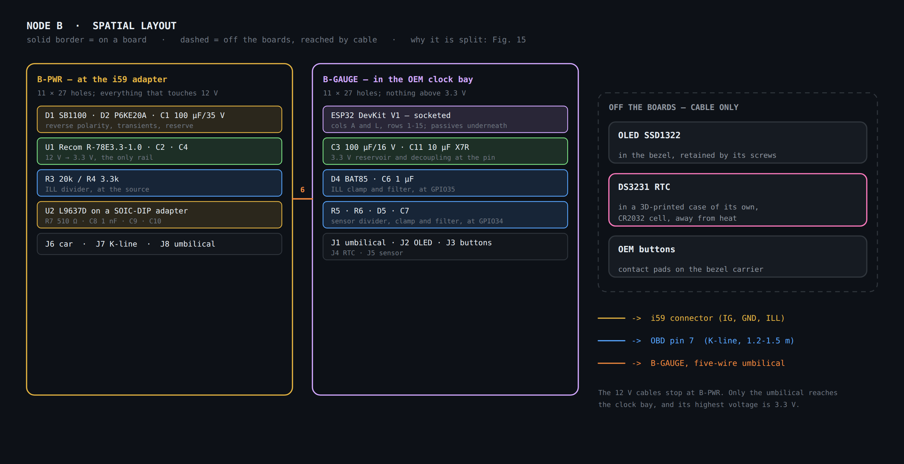
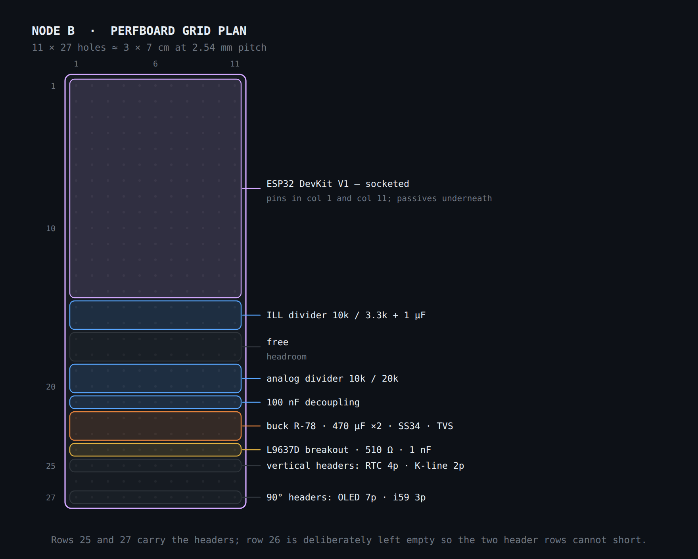

# Node B — Gauge

ESP32 in the centre console, in the OEM clock bay. Reads the ECU over **SSM2** on
the K-line, drives the OLED, and sends vehicle speed to Node A over ESP-NOW. See
the [component catalogue](README.md#component-catalogue) and
[BOM](README.md#bom-with-indicative-prices) for the parts referenced by `Ref`
below.

## Stages and exact values

### Stage 1 · Power (IG to 5 V)

| Ref | Component | Value | Connection | Function |
| --- | --- | --- | --- | --- |
| F1 | Fuse + holder | 2 A | series in +12 V (IG) | opens on a short |
| D1 | Schottky diode | SS34 | +12 V → VBAT (series) | reverse polarity |
| D2 | Unidirectional TVS | SMAJ18A | VBAT → GND | transients |
| C1 | Electrolytic | 470 µF / 35 V | VBAT → GND | input reserve |
| C2 | Ceramic | 100 nF | VBAT → GND | HF filter |
| U1 | Switching regulator | Recom R-78E5.0-1.0 | VBAT → 5 V | fixed 12 V→5 V (7805 drop-in) |
| C3 | Electrolytic | 470 µF / 16 V | 5 V → GND | Wi-Fi spikes |
| C4 | Ceramic | 100 nF | 5 V → GND | HF filter |

### Stage 2 · Ignition and illumination (ILL) sensing

Two identical dividers bringing 12 V down to a safe level. The ILL one carries a
larger capacitor to average the signal if the illumination is PWM-dimmed by the
dash rheostat.

| Ref | Component | Value | Connection | Function |
| --- | --- | --- | --- | --- |
| R1 | Resistor | 10 kΩ | IG → node_IGN | upper leg |
| R2 | Resistor | 3.3 kΩ | node_IGN → GND | lower leg (≈3.0 V @ 12 V) |
| D3 | Schottky clamp | BAT85 | node_IGN → 3.3 V | clips above 3.3 V |
| C5 | Ceramic | 100 nF | node_IGN → GND | filter → GPIO |
| R3 | Resistor | 10 kΩ | ILL → node_ILL | upper leg |
| R4 | Resistor | 3.3 kΩ | node_ILL → GND | lower leg |
| D4 | Schottky clamp | BAT85 | node_ILL → 3.3 V | clips |
| C6 | Ceramic | 1 µF | node_ILL → GND | averages PWM → ADC |

### Stage 3 · Analogue input (0-5 V sensor, optional)

| Ref | Component | Value | Connection | Function |
| --- | --- | --- | --- | --- |
| R5 | Resistor | 10 kΩ | sensor → node_AN | upper |
| R6 | Resistor | 20 kΩ | node_AN → GND | lower (5 V→3.3 V) |
| D5 | Schottky clamp | BAT85 | node_AN → 3.3 V | clips |
| C7 | Ceramic | 100 nF | node_AN → GND | filter → ADC |

> **Thermocouples do not go through a divider** — they output millivolts. For
> oil or gearbox temperature, use a dedicated **MAX31855** amplifier (type K, SPI
> output) as a separate module. Deferred to the expansion phase.

### Stage 4 · K-line transceiver (L9637D to OBD pin 7)

| Ref | Component | Value | Connection | Function |
| --- | --- | --- | --- | --- |
| U2 | Transceiver | L9637D | — | K-line ↔ UART |
| R7 | Resistor (RKO) | 510 Ω | K → VS (12 V) | bus pull-up |
| C8 | Ceramic (CK) | 1 nF | K → GND | bus filter (≤1.3 nF) |
| C9 | Ceramic | 100 nF | VCC (3.3 V) → GND | logic decoupling |
| C10 | Ceramic | 100 nF | VS (12 V) → GND | power decoupling |

*Connections: VS→12 V (IG) · VCC→3.3 V · RX→GPIO16 · TX→GPIO17 · K→OBD pin 7 ·
common GND. An L9637D breakout usually carries R7/C8 on board.*

The K-line reaches the console on **i59 pin 7**, which the factory clock circuit
does not use at all — see the [i59 adapter](assembly-and-wiring.md#i59-adapter-1-male--2-female),
where the factory diagram establishes which pins are free and why the installation
stays reversible.

### Stage 5 · Display, clock and buttons

| Block | Connection | Component note |
| --- | --- | --- |
| OLED SSD1322 (SPI) | VCC 3.3 V · GND · SCLK 18 · MOSI 23 · CS 5 · DC 19 · RST 4 | set the jumpers to 4-wire SPI |
| RTC DS3231 (I²C) | VCC 3.3 V · GND · SDA 21 · SCL 22 | I²C pull-ups already on the module |
| 4 OEM buttons | GPIO 32/33/25/26 ↔ contact pad ↔ GND | `INPUT_PULLUP` + 100 nF debounce (optional) |

#### The buttons are the OEM ones, reused

The four controls are the car's existing buttons — **DISP**, **SET** and the
**− +** rocker — not new hardware. That is the retromod constraint, and the
teardown of a donor unit confirmed it is practical.

**Photo** — The unit out of the dash. DISP at bottom left, the **− +** rocker and
**SET** at the right: the four functions the pin map above assumes.

They are not tactile switches. They are **interdigitated contact pads etched on
the OEM board**, closed by a conductive rubber pad behind the bezel — the same
construction as a TV remote keypad.

**Photo** — The donor unit's board: VFD display and driver, with the button
contact pads outlined in red. A **donor unit** was taken apart for this — same
generation and housing, but the base clock-only trim with one button fewer. It is
not the unit going into the car.

Electrically this is the good case: a pad closure is an ordinary dry contact with
no OEM silicon in the path, so it wires straight to a GPIO with `INPUT_PULLUP`
and the other side to ground. The internal pull-up is around 45 kΩ, high enough
that even a conductive-rubber contact of a few kΩ pulls the pin firmly below the
logic-low threshold — no external conditioning needed.

Mechanically it constrains the carrier: either the OEM board's pad area is cut out
and retained, or the carrier reproduces the pad geometry so the original rubber
lands on it. That choice, and the pad layout on the car's own trim, are open — see
[ADR 0004](../decisions/0004-reuse-oem-contact-pad-buttons.md).

> **Mode confirmation from Node A.** The auto-lock ON/OFF button lives on **Node
> A** (a reused OEM switch), not here. Node B does not generate that toggle — it
> only **receives** the mode change over ESP-NOW when it happens and shows it on
> the OLED for a couple of seconds as confirmation. This needs no new hardware on
> Node B, only firmware to handle the inbound message. See
> [ADR 0003](../decisions/0003-onoff-button-direct-to-node-a.md) and
> [`docs/02-firmware/`](../02-firmware/README.md).

## ESP32 pin map (Node B)

| Peripheral | Signal | GPIO | Note |
| --- | --- | --- | --- |
| OLED (SPI) | MOSI | 23 | 4-wire SPI |
| OLED (SPI) | SCLK | 18 | 4-wire SPI |
| OLED (SPI) | CS | 5 | 4-wire SPI |
| OLED (SPI) | DC | 19 | 4-wire SPI |
| OLED (SPI) | RST | 4 | 4-wire SPI |
| RTC (I²C) | SDA | 21 | DS3231 |
| RTC (I²C) | SCL | 22 | DS3231 |
| K-line (UART2) | RX | 16 | L9637D VCC = 3.3 V |
| K-line (UART2) | TX | 17 | L9637D VCC = 3.3 V |
| Buttons | DISP | 32 | `INPUT_PULLUP` |
| Buttons | SET | 33 | `INPUT_PULLUP` |
| Buttons | [+] | 25 | `INPUT_PULLUP` |
| Buttons | [−] | 26 | `INPUT_PULLUP` |
| ILL (dimming) | ADC | 35 | Stage 2 |
| Analogue sensor | ADC | 34 | Stage 3 |
| Speed (transmit) | — (radio) | ESP-NOW → Node A |
| Mode confirmation (receive) | — (radio) | ESP-NOW ← Node A, shown on the OLED |

## Schematics and physical layout

Four complementary views: the power stage, the signal interface, the full spatial
layout, and the exact plan on the 11 × 27 perfboard grid. Wire colour code:
**yellow +12 V · copper +5 V · red +3.3 V · grey GND · blue signal**.

### Power stage

**Fig. 2** — Node B power stage. 12 V reaches only the buck, the protection chain
and (in the signal interface) the L9637D's VS pin. The same stage is used on
Node A.

### Signal interface (K-line, OLED, RTC)

**Fig. 3** — Node B signal interface. No signal connector touches 12 V: the only
12 V nets here are the L9637D's VS pin and the 510 Ω bus pull-up.

### Where it goes in the car

**Photo** — The bay the gauge has to keep: between the upper storage compartment
and the head unit. Same position, same viewing angle, same night-time dimming
behaviour as the OEM trip computer.

**Photo** — The donor housing at an angle: outer smoked lens, reddish inner panel
behind it, and the internal depth the carrier board and the OLED have to fit
into. The SSD1322 needs roughly 79 × 21 mm of active area and about 6 mm of
depth; the carrier is 3 × 7 cm. Confirm both against the car's own unit before
committing to a board outline.

### Full spatial layout

**Fig. 4** — Spatial layout. Solid border = on the board; dashed = off the board,
reached by cable. The OLED and RTC arrive only by cable, at the connector rows.

### Exact plan on the perfboard grid

**Fig. 5** — Exact plan on the grid. Row 27 (the edge) carries the 90° headers;
row 25 (behind it) the vertical headers; row 26 is left empty. The dividers are
placed as zones — each resistor lands somewhere inside its band when soldered.
The board is 3 × 7 cm — see
[perfboard size](README.md#perfboard-size-correction-to-the-source-document).
