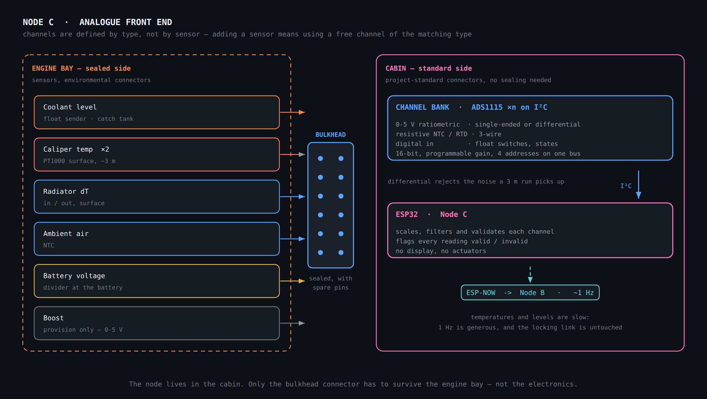
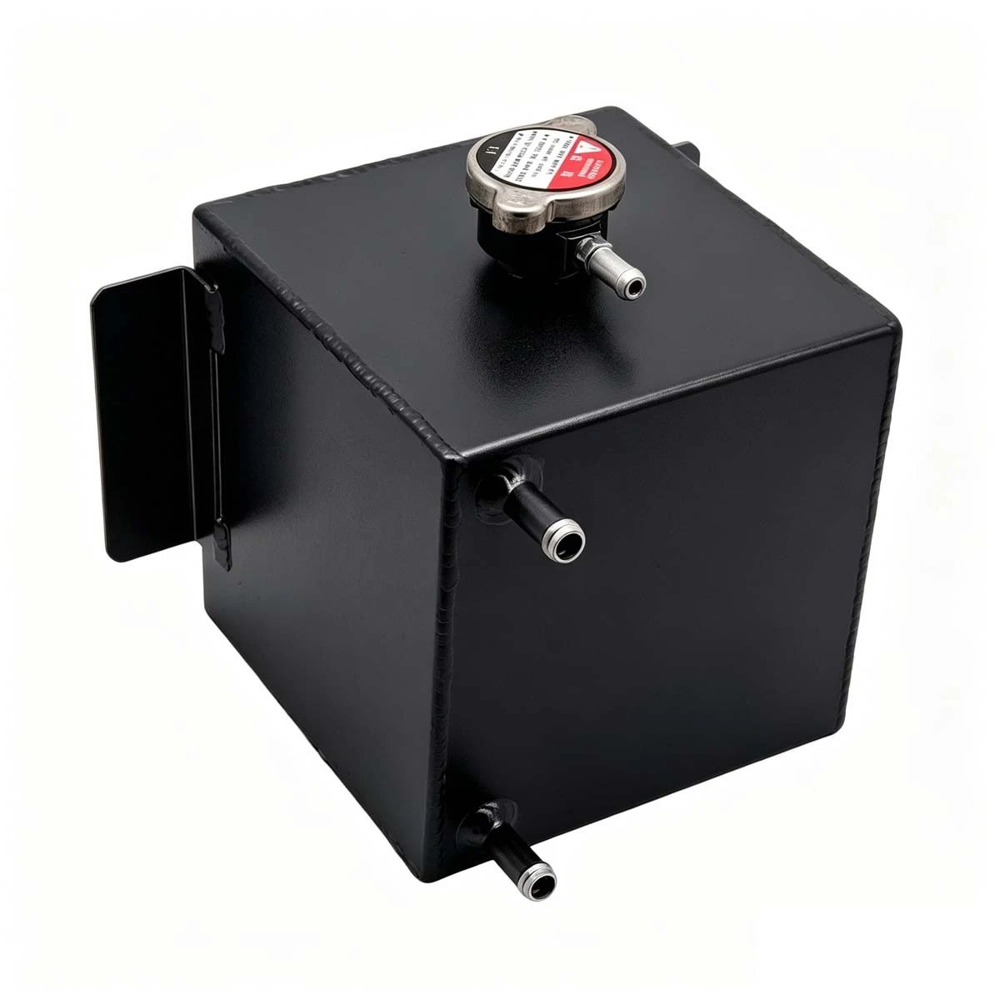

# Node C — Analogue front end

ESP32 in the cabin, near the firewall pass-through. No display, no actuators: it
reads analogue and digital channels, validates them, and sends values to Node B
over ESP-NOW at about 1 Hz.

Planned for **v0.3** — see [`ROADMAP.md`](../../ROADMAP.md). The reasoning behind
its architecture and its location is in
[ADR 0006](../decisions/0006-node-c-analogue-front-end.md).

**Fig. 11** — The node lives in the cabin; only the bulkhead connector has to
survive the engine bay. Channels are defined by type, so adding a sensor later
means using a free channel of the matching type rather than redesigning anything.

## Channel architecture

This is the part that matters. The sensors below are an instance of it, not a
definition of it.

| Channel type | Interface | Suits |
| --- | --- | --- |
| **Ratiometric 0–5 V** | sensor fed 5 V, returns 0–5 V, divided to 3.3 V. Single-ended, or differential where the run is long | boost, oil and fuel pressure, most aftermarket senders |
| **Resistive NTC / RTD** | pull-up forms a divider; **3-wire** so lead resistance cancels | PT1000 surface sensors, coolant and oil temperature senders, ambient air |
| **Digital in** | pulled up, switch to ground | float switches, fan state, any on/off |

Conversion is external: **ADS1115 over I²C** — 16 bit, programmable gain, four
addresses on one bus, and differential inputs. The ESP32's own ADC is not used for
measurement here; it is non-linear, noisy, its reference moves, and ADC2 is
unavailable altogether once Wi-Fi is in the firmware
([ADR 0005](../decisions/0005-ota-in-maintenance-mode.md)).

Two rules that apply to every channel:

- **Ratiometric sensors are measured against their own 5 V supply**, not against
  an absolute reference. Otherwise every variation of the supply appears as sensor
  error. For channels where the sensor draws enough current to matter, use four
  wires: supply, sense, signal, return.
- **Each sensor's return comes back to the node** — never grounded locally at the
  engine, for the reason given in
  [ADR 0006](../decisions/0006-node-c-analogue-front-end.md#consequences).

Protection per channel follows the pattern already used on Node B: series
resistor, divider, Schottky clamp to the 3.3 V rail, RC filter.

## The bulkhead connector

A single **sealed connector at the firewall** is the boundary between the two
environments — environmental connectors and cable on the engine-bay side, the
project's standard Micro-Fit on the cabin side. It is specified **with spare pins
from the first installation**; its pin count is
[`OC-11`](../04-integration/README.md#open-checks-on-the-vehicle). Why the boundary
is the connector and not the node is in
[ADR 0006](../decisions/0006-node-c-analogue-front-end.md#decision).

## Sensors fitted first

### Coolant level — catch tank

**Photo** — The 2 L welded catch tank fitted to this car, which replaced the OEM
expansion bottle when the larger aluminium radiator went in. The radiator hose
connects to the lower spigot; the upper side spigot is blocked; the cap's pressure
function is defeated and the outlet at the cap is **open to atmosphere**.

**The tank is not pressurised.** That bounds the sensor usefully: liquid to
roughly 105–110 °C, no pressure rating, no pressure-rated seal. Standard float
senders are usable.

**What is measured, and what is not.** The purpose is to know **when to top up**,
so the radiator never draws air, and when the tank is near overflowing. Thermal
expansion — about 600 mL, which over this tank's cross-section is roughly **4 cm**
of level — is a *disturbance*, not the signal. Two consequences:

- **Resolution can be coarse.** Knowing which third of the tank you are in is
  enough. A reed-chain sender with ~1 cm steps gives about ten usable steps, and
  quantisation provides its own hysteresis. A continuous resistive sender works
  equally well.
- **Only the cold reading means anything.** Hot and cold levels differ by about a
  third of the tank. The number that matters is captured on the first reading
  after a cold soak — in practice when the key is turned in the morning. It is
  retained and displayed; the live level while driving does not answer "should I
  top up".

**Why cold.** As the system cools it draws coolant back from the tank into the
radiator; if the tank empties during that draw-back, the radiator takes air. In
winter the fall from operating temperature to ambient is larger, more volume is
drawn back, and the tank must start higher. The critical value is the minimum of
the cycle, which occurs fully cold.

**Working range.** No factory marks exist on a custom tank, so they come from its
geometry:

| Mark | Definition | Why |
| --- | --- | --- |
| **MIN** | 1 cm above the lower spigot | keeps the radiator's return submerged so it never draws air |
| **MAX** | 1 cm below the upper spigot | leaves headroom so expansion does not reach the overflow path |

Since expansion is around 4 cm, **the usable cold-fill window is MIN to
(MAX − expansion)**, not MIN to MAX. If that window turns out narrow or negative,
the tank is too small for the system's expansion volume — worth knowing. Verify
against real measurements: [`OC-09`](../04-integration/README.md#open-checks-on-the-vehicle).

**Sudden-loss detection, from the same sensor.** A failed hose or a head gasket
pushing coolant out shows as a **rapid, monotonic fall** — easy to separate from
slosh, which oscillates about zero, and from expansion, which rises with
temperature. A rate-of-change detector, not a threshold, and on track it warns
before the temperature gauge does.

**Two normal behaviours that are not faults.** The tank is vented, so it loses a
little coolant to evaporation: the long record shows a slow downward drift that is
not a leak. And a **stilling well** around the float — a vertical tube open at the
bottom through a small orifice — damps slosh mechanically. With the reading taken
cold it is not essential, but it costs almost nothing if the sender mount is being
fabricated anyway.

Mounting: a bung welded to the tank's top face. This tank is already an aftermarket
part fabricated for this car, so adding a bung is ordinary fabrication — the
project's rule against modifying OEM parts does not apply to it.

### Caliper temperature

**PT1000 surface RTDs, bonded with high-temperature adhesive**, one per front
caliper. Not thermocouples, and not infrared.

The RTD avoids both problems that make a thermocouple awkward here. It needs **no
alloy-specific extension wire** — ordinary copper, with a third wire to cancel lead
resistance — and **no cold-junction compensation**, so nothing has to know the
temperature of the connector or of the amplifier. It is simply a resistance, which
lands on a resistive channel like any other.

Range suits the measurement. A typical surface PT1000 reaches 200–250 °C. What is
being measured is the **caliper body**, which is neither rotor nor pad temperature
— it lags and reads much lower — but is a good proxy for **brake fluid
temperature**, which is what produces fade and a long pedal. Good DOT4 boils
around 230 °C dry and well below that once moisture is absorbed, so a sensor that
covers up to ~250 °C spans the entire useful range: if it saturates, the brakes are
already past their limit.

Bonded rather than bolted. Every fastener on a caliper is safety-critical, and an
adhesive sensor avoids the question entirely.

Lead length is in the [cable schedule](assembly-and-wiring.md#cable-lengths).

### Radiator inlet and outlet

Two channels, radiator inlet and outlet. The **difference** is the diagnostic: a
falling ΔT at a given load points at a blocked radiator or a tired water pump.
Absolute coolant temperature is already available over SSM2 and on the car's Defi
gauges, so it is the delta and its trend that this adds.

Mounting is [`OC-10`](../04-integration/README.md#open-checks-on-the-vehicle):
surface sensors on the hoses are non-invasive but read low and lag, though for a
*difference* that bias partly cancels; in-line fittings are accurate but mean
cutting hoses and accepting two more leak points.

### Ambient air, and battery voltage

**Ambient air:** one NTC, sited in the engine bay or behind the front bumper.

**Battery voltage:** a divider at the battery. Measured locally rather than taken
from SSM2 because the ECU's reported voltage is coarse, and because **during
cranking — exactly when the reading is interesting — SSM2 polling stalls**. Battery
*current* was considered and deliberately left out; see *Left unresolved* in
[ADR 0006](../decisions/0006-node-c-analogue-front-end.md).

### Boost — provision only

Not fitted: this car is naturally aspirated. It is listed because a boost sensor is
a 3-wire ratiometric 0–5 V device, which is to say **it is not a feature of this
node at all — it is one free 0–5 V channel**. Anyone reproducing this project on a
turbocharged car connects the sensor and assigns a channel. Documenting it costs
nothing and demonstrates that the channel-typed architecture does what it claims.

## Update rate and validity

Every quantity here is slow; several channels would be adequate at 0.2 Hz. The
cadence, the validity flag and what they mean for the radio link are specified in
[`docs/02-firmware/`](../02-firmware/README.md#link-topology).

## Open items

- [`OC-09`](../04-integration/README.md#open-checks-on-the-vehicle) — level sender
  zero calibration against MIN and MAX, on a bled, cold system.
- [`OC-10`](../04-integration/README.md#open-checks-on-the-vehicle) — radiator ΔT
  sensor mounting.
- [`OC-11`](../04-integration/README.md#open-checks-on-the-vehicle) — channel
  count, and therefore the bulkhead connector's pin count.
- The **ESP-NOW packet format**, which with a third node becomes a small protocol.
  Settle it **before** Node C is built —
  [`docs/02-firmware/`](../02-firmware/README.md#open-items).
